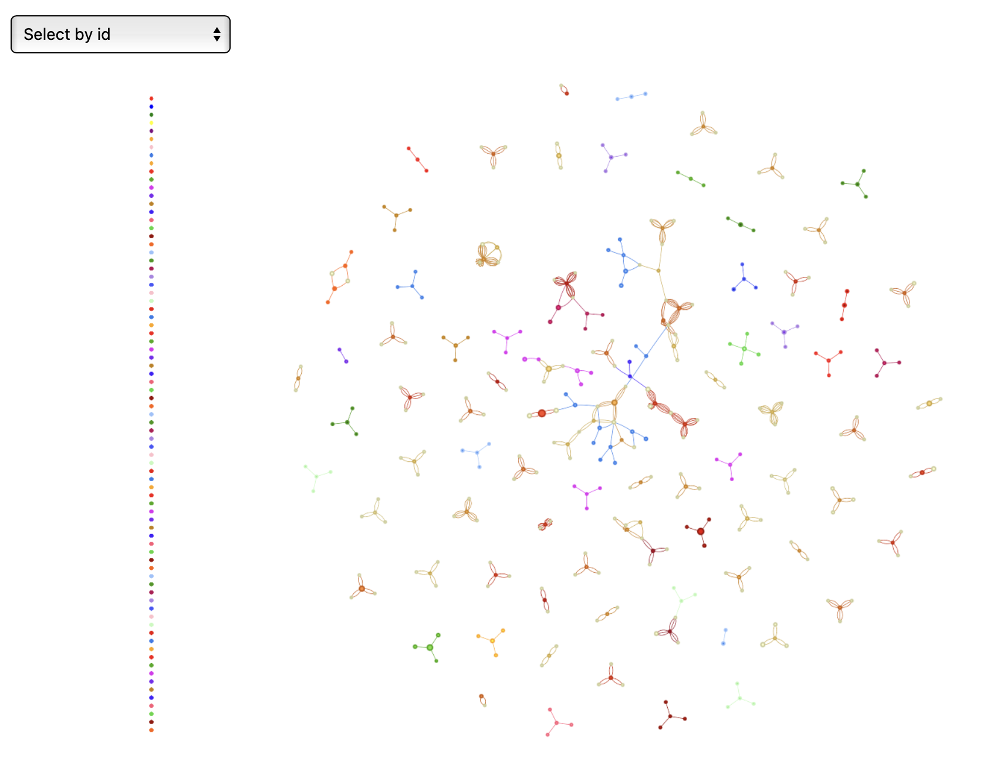
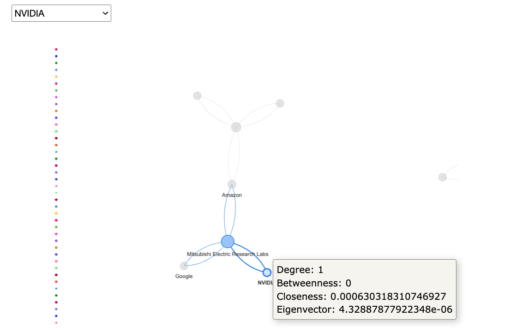

\newpage
# Einleitung

## Requirements
Zunächst müssen die benötigten Bibliotheken installiert werden:

- $ install.packages("tidyverse")
- $ install.packages("igraph")
- $ install.packages("visNetwork")
- $ install.packages("dplyr")
- $ install.packages("tidyr")
- $ install.packages("kableExtra")
- $ install.packages("webshot")
- $ install.packages("knitr")
- $ install.packages("ggplot2")
- $ install.packages("RColorBrewer")

Und anschließend geladen werden:
```{r setup, message=FALSE, warning=FALSE}
library(tidyverse)
library(igraph)
library(visNetwork)
library(dplyr)
library(tidyr)
library(knitr)
library(kableExtra)
library(webshot)
library(ggplot2)
library(RColorBrewer)
```


## Motivation und Zielsetzung
In ihrem Artikel "Data Scientist: The Sexiest Job of the 21st Century"
betonen Davenport und Patil, dass Data Scientists durch ihre Fähigkeiten in Informatik, 
Statistik und ihr Fachwissen allgemein einen erheblichen Mehrwert für Unternehmen schaffen.^[Davenport, Patil 2012]
Die Fähigkeit, aus komplexen, unstrukturierten Daten wertvolle Erkenntnisse zu gewinnen, 
macht Data Scientisten in vielen Branchen zu einer unverzichtbaren Ressource.^[Davenport, Patil 2012]
Die Nutzung ihrer Kompetenzen verschafft Unternehmen einen Wettbewerbsvorteil, 
da sie datengetriebene Entscheidungen, Produktinnovationen und Effizienzsteigerungen ermöglicht.^[Davenport, Patil 2012]

Darüber ob Data Scientists immer noch the "Sexiest Job" des 21. Jahrhunderts sind, lässt sich streiten.
Fakt ist jedoch, dass die Nachfrage nach Data Scientists in den letzten Jahren stark gestiegen ist und 
vorraussichtlich immer weiter steigen wird. 
Dieser Trend ist auch in den Google-Suchanfragen zu den Begriffen erkenntlich:^[Google Trends, abgerufen am 30.10.2024]
```{r, include=FALSE} 

# Read the CSV file, skipping the first row
data <- read_csv("data/GOOGLE_SEARCH_DATA.CSV", skip = 1)

# Clean the data: Convert "<1" to 0.5 for plotting purposes
data <- data %>%
  mutate(`data science` = ifelse(`data science` == "<1", 0.5,
                                 as.numeric(`data science`)),
         `data scientist` = ifelse(`data scientist` == "<1", 0.5,
                                   as.numeric(`data scientist`)))

# Convert the 'Monat' column to Date type
data$Monat <- as.Date(paste0(data$Monat, "-01"))
```
```{r, fig.width=12, fig.height=6}

ggplot(data, aes(x = Monat)) +
  geom_line(aes(y = `data science`, color = "data science")) +
  geom_line(aes(y = `data scientist`, color = "data scientist")) +
  labs(title = "Google Suchtrend für 'data science' und 'data scientist'",
       x = "Datum",
       y = "Interesse",
       color = "Suchbegriff") +
  theme_minimal()
```

Das wachsende Interesse an Data Science stellt eine große Chance für Arbeitnehmer dar. Ziel dieser Arbeit ist es
einen Überblick über den Data-Science-Jobmarkt zu geben, um Arbeitnehmern bei der Jobsuche zu helfen und
andererseits einen Überblick über die Gehälter und die Rolle von Geographie und Wettbewerb bei Jobangeboten und Gehältern zu geben.

## Forschungsfrage
Im Rahmen der vorliegenden Arbeit wird die folgende Forschungsfrage bearbeitet:

Inwiefern beeinflusst die geografische Nähe von Unternehmen das Gehaltsniveau und die 
Verfügbarkeit von Data-Science-Jobs? Lässt sich eine signifikante Variation der Einkommen 
innerhalb regionaler Cluster feststellen, und wie kann diese durch Netzwerkzentralität erklärt 
werden?

Zur Beantwortung dieser Forschungsfrage soll zudem analysiert werden, inwiefern das Wettbewerbsumfeld 
zwischen Unternehmen die Gehaltsstruktur im Bereich Data Science beeinflusst und welche Rolle zentrale 
Unternehmen bei der Bestimmung des Gehaltsniveaus spielen.


## Datengrundlage
Nachdem die Daten in Python extern als Vorbereitung aufbereitet wurden, kann nun die Datengrundlage für diese Arbeit in R eingelesen werden. 
Dabei wurde sich an https://www.kaggle.com/code/fahadrehman07/data-science-job-salary-prediction-glassdoor orientiert.

### CSV einlesen
```{r}
data <- read_csv("data/Glassdoor_DataScience_Salary.csv")
```

Die vorliegende Arbeit basiert auf einem Datensatz von Kaggle, der Informationen über Data Science Jobs in verschiedenen Unternehmen für den US-amerikanischen Markt enthält. 
Der Datensatz umfasst 742 Zeilen und 28 Spalten, was auf eine Anzahl von 742 verschiedenen Jobangeboten hindeutet. 
Diese Anzahl ist kann für die Zwecke dieser Arbeit als ausreichend zu betrachten, auch wenn eine höhere Zahl an Beobachtungen möglicherweise zu präziseren Schlussfolgerungen geführt hätte.

Der Datensatz beruht auf Daten, die von Glassdoor extrahiert wurden, eine für Stellenanzeigen und Unternehmensbewertung bekannte Website, und bietet 
detaillierte Informationen über Data-Science-Jobs sowie deren Gehälter. Der Datensatz beinhaltet wesentliche Informationen, darunter Jobtitel, 
geschätzte Gehälter, Stellenbeschreibungen, Unternehmensbewertungen sowie relevante Unternehmensdaten wie Standort, Größe und Branche. 
Eine detaillierte Beschreibung dieser Daten erfolgt im späteren Verlauf. 
Der Datensatz eignet sich in besonderem Maße für den Zweck dieser Arbeit, aber auch für Analysen des Arbeitsmarktes, beispielsweise 
zur Untersuchung von Gehaltstrends oder zur Identifizierung der am besten bewerteten Unternehmen. 

Der Datensatz umfasst konkret die folgenden Spalten:

### Erste Ansicht der Daten
```{r}
head(data, 5)
spec(data)
summary(data)
```
Im Folgenden wird eine Übersicht der wesentlichen Spalten präsentiert:

- `Job Title`: Die Berufsbezeichnung, sie gibt Aufschluss über die Tätigkeit.
- `Salary Estimate`: Die geschätzte Gehalt, in tausend Dollar pro Jahr. Es basiert auf dem Durchschnitt von dem minimalen und maximalen Gehalt.
- `Job Description`, `Job_simp`: Die Beschreibung der Stelle, die Aufgaben und Anforderungen enthält. Auch die vereinfachte Version der Berufsbezeichnung.
- `Rating`: Die Bewertung des Unternehmens, sie weist eine Spannbreite von 1 bis 5 auf, wobei die Bewertung "-1" bei jeder Spalte für fehlende Bewertungen steht.
- `Company Name`, `Location`, `Headquarters`, `Size`, `Founded`: Unternehmensbezogene Daten wie Name, Standort, Sitz, Größe und Gründungsjahr des Unternehmens.
- `Type of ownership`, `Industry`, `Sector`, `Revenue`: Weitere Unternehmensmerkmale, diese umfassen die Eigentumsart, die Branche, den Sektor sowie die Einnahmen.
- `Competitors`: Die Wettbewerber des Unternehmens, die im Zusammenhang dieser Arbeit von besonderer Bedeutung sind.
- Skills (`Python_yn`, `R Studio`, `Spark`, `AWS_yn`, `Excel_yn`): Spalten, aus denen hervorgeht, ob die betreffende Kompetenz in der Stellenbeschreibung verlangt wird (0 = nein, 1 = ja).
- `Min_salary`, `Max_salary`: Minimale und maximale Gehaltsschätzungen.
- `State`, `Same State`, `job_state`, `Age`, `desc_len`, `Num_comp`: Zusätzliche Informationen wie Standort der Stelle, Alter des Unternehmens, Länge der Stellenbeschreibung und Anzahl der Mitbewerber.

Es zeigt sich, dass eine Vielzahl von Spalten für die vorliegende Untersuchung irrelevant ist. 
Infolgedessen werden in einem späteren Teil der Arbeit irrelevante Spalten, wie beispielsweise die Kenntnisse in Python, R Studio, Spark und ähnlichen Programmen, welche ursprünglich aus der Jobbeschreibung extrahiert wurden, entfernt.

Nachdem die Daten in Python mit Hilfe von Pandas bereinigt, ergänzt und bearbeitet wurden, können sie nun in R eingelesen werden. 
Dabei wurde sich an https://www.kaggle.com/code/maxzeitler/data-science-job-salary-prediction-glassdoor/edit orientiert.

Im Folgenden wird eine erste Betrachtung der Daten vorgenommen. Zu diesem Zweck werden die Jobs in New York nach ihren jeweiligen Vergütungen geordnet und in Form eines Balkendiagramms dargestellt.
```{r, fig.height=15, fig.width=15}

# Filterung der Daten für New York
data_ny <- data %>%
  filter(State == "NY")

# Durchschnittsgehalt nach Berufsbezeichnung
avg_salary_by_job_ny <- data_ny %>%
  group_by(`Job Title`) %>%
  summarise(Average_Salary = mean(`Salary Estimate`, na.rm = TRUE)) %>%
  arrange(desc(Average_Salary))

# Bar Plot
ggplot(avg_salary_by_job_ny,
       aes(x = reorder(`Job Title`, Average_Salary), y = Average_Salary)) +
  geom_bar(stat = "identity") +
  coord_flip() +
  labs(title = "Average Salary by Job Title in NY",
       x = "Job Title",
       y = "Average Salary") +
  theme_minimal() +
  theme(
    axis.title = element_text(size = 14),
    axis.text = element_text(size = 12),
    plot.title = element_text(size = 16, face = "bold")
  )
```
todo ... Insights aus dem Plot ziehen


Da die Datengrundlage nicht in einem igraph-Objekt vorliegt und ungerichtet ist, 
ist es notwendig Knoten, Kanten sowie relevante Attribute wie beispielsweise 
Gewichtungen zu definieren, um überhaupt Netzwerkvisualisierungen in R durchführen zu können.
Doch dazu mehr im nächsten Kapitel.


\newpage
# Analysestrategie

1. Geografisches Netzwerk

Das Ziel besteht in der Erstellung eines Netzwerkes, welches auf der räumlichen Nähe von Unternehmen basiert. 
Auf diese Weise soll untersucht werden, inwiefern regional bedingte Faktoren die Gehälter beeinflussen.
Die Bildung von Kanten erfolgt nach dem Kriterium der räumlichen Nähe. 
Dabei werden Unternehmen, die im gleichen Ort angesiedelt sind, durch Kanten verbunden. 

2. Wettbewerbsnetzwerk

Die vorliegende Untersuchung zielt darauf ab, den Einfluss des Wettbewerbs auf die Gestaltung von Gehaltsstrukturen zu analysieren. 
Dazu werden die Beziehungen zwischen konkurrierenden Unternehmen als Netzwerk dargestellt.
Die Bildung von Kanten durch Konkurrenzen erfolgt wie folgt:
Die in der Spalte "Competitors" gelisteten Unternehmen werden als Knoten verbunden.
In Bezug auf die Gewichtung sind verschiedene Optionen denkbar. 
Beispielsweise könnte die direkte Konkurrenz mit dem Wert "1" und die indirekte Konkurrenz mit dem Wert "0,5" bewertet werden. 
Dabei würde die indirekte Konkurrenz eine Branche umfassen, in der das Unternehmen zwar nicht als direkter Konkurrent aufgeführt ist, jedoch potenziell in Konkurrenz stehen könnte.
Im Rahmen der Netzwerkmetriken erfolgt eine Analyse der folgenden Aspekte:
Im Rahmen der Analyse von hierarchischen Beziehungen und unterschiedlichen Zentralitäten erfolgt eine Untersuchung der Wichtigkeit eines Unternehmens im Wettbewerbsnetzwerk sowie der Gehaltshöhen in Relation zur Konkurrenz.

3. Vergleich der Gehälter innerhalb der Netzwerke

Im Rahmen der  Analyse werden die Gehälter innerhalb der beiden Netzwerke miteinander verglichen. 
Ziel ist die Identifikation von Unternehmen, die zentral in einem der beiden Netzwerke liegen, und solchen, die am Rand oder isoliert sind, um festzustellen, ob die zentralen Unternehmen höhere Gehälter anbieten.
Zur Durchführung des Gehaltsvergleichs werden Korrelationen zwischen dem Gehalt und verschiedenen Zentralitätsmaßen innerhalb der geografischen und wettbewerbsbezogenen Netzwerke herangezogen. 
Darüber hinaus werden Cluster-Analysen durchgeführt, um Unternehmen, die geografisch und wettbewerbsbedingt vernetzt sind, miteinander zu vergleichen.

4. Zusammenführung und Vergleich der Netzwerke

Im Rahmen der Zusammenführung und des Vergleichs der Netzwerke erfolgt eine Gegenüberstellung der jeweiligen Strukturen, um etwaige Gemeinsamkeiten und Unterschiede zu identifizieren.
Das Ziel dieser Untersuchung besteht in der Analyse der Interaktion beider Netzwerke sowie der Identifikation von Regionen, in denen eine besonders hohe Gehaltskonkurrenz zu beobachten ist.
Im Rahmen des Vergleichs der Netzwerke hinsichtlich der Gehälter und des Wettbewerbs erfolgt zunächst eine Gegenüberstellung der Gehaltsverteilung in sogenannten "Hotspot-Regionen" und geografisch isolierten Regionen.
Darüber hinaus werden gemeinsame Unternehmen in beiden Netzwerken sowie die Gehaltsstrukturen innerhalb der Überschneidungsbereiche analysiert.


\newpage
# Analyse
## Datenbereinigung

### Bereinigung für die geografische Analyse
Bei der Durchsicht des Datensatzes viel auf, dass die Spalten "Same State" und "job_state" von der Logik her ähnlich sind.
Dies soll nun näher unterucht werden, um spätere Fehler vorzubeugen, vor allem bei den geografischen Netzwerken vorzubeugen.

```{r}
# Auswahl der "State" und "job_state" Spalten
selected_data <- data %>%
  select(State, job_state)

# Heading der ausgewählten Spalten
head(selected_data, 15)
```

Sieht so aus, als wäre beide Spalten identisch. Dies soll jedoch zur Probe gestellt werden:

```{r}
if (all(selected_data$State == selected_data$job_state, na.rm = TRUE)) {
  print("Alle Werte in 'State' und 'job_state' sind identisch.")
} else {
  print("Es gibt Unterschiede zwischen 'State' und 'job_state'.")
}
```

Jedoch trügt der Schein, da es Unterschiede gibt.

```{r}
# Auswahl der Zeilen, in denen "State" und "job_state" unterschiedlich sind
different_states <- selected_data %>%
  filter(State != job_state)

print(different_states, n = Inf)
```

Es fällt auf, das LA und Los Angeles nicht einheitlich verwendet werden. Außerdem ist Los Angeles kein eigener Bundesstaat, sonder ein Teil von Kalifornien(CA). Dies soll nun korrigiert werden.

Außerdem sollte bei weieren Vorgehen beachtet werden, dass Werte wie "Na" oder "-1" vor den Analysen entfernt werden sollten.
```{r}
# Ersetzen von "Los Angeles" durch "LA" und "LA" durch "CA"
data <- data %>%
  mutate(State = ifelse(State == "Los Angeles", "LA", State),
         job_state = ifelse(job_state == "Los Angeles", "LA", job_state))

data <- data %>%
  mutate(State = ifelse(State == "LA", "CA", State),
         job_state = ifelse(job_state == "LA", "CA", job_state))

# Erneute Überprüfung
selected_data <- data %>%
  select(State, job_state)

if (all(selected_data$State == selected_data$job_state, na.rm = TRUE)) {
  print("Alle Werte in 'State' und 'job_state' sind identisch.")
} else {
  print("Es gibt Unterschiede zwischen 'State' und 'job_state'.")
}
```

### Überprüfung auf weitere fehlende Werte

```{r}
# Überprüfen auf NA-Werte

na_counts <- colSums(is.na(data))
print("Anzahl der NA-Werte pro Spalte:")
print(na_counts)

# Überprüfen auf -1-Werte
neg_one_counts <- sapply(data, function(x) sum(x == -1, na.rm = TRUE))
print("Anzahl der -1-Werte pro Spalte:")
print(neg_one_counts)
```

Es zeigt sich, dass es keine NA-Werte gibt, jedoch einige -1-Werte, die entfert werden sollten.

```{r}
# Entfernen von Zeilen mit -1 Werten
data <- data %>%
  filter_all(all_vars(. != -1))

# Überprüfen auf -1-Werte nach Entfernung
neg_one_counts <- sapply(data, function(x) sum(x == -1, na.rm = TRUE))
print("Anzahl der -1 Werte pro Spalte:")
print(neg_one_counts)
```

### Entfernen irrelevanter Spalten
Basierend auf der Analysestrategie und den geplanten Analysen werden jetzt noch die Spalten, 
die nicht für die anfängliche geografische Analyse und die nachfolgende Wettbewerbsanalyse 
benötigt werden, entfernt.
```{r}
# Entfernen irrelevanter Spalten
# Job Description, Rating, Headquarters, Size, Founded, Type of ownership, Sector, Revenue und Skills
data <- data %>%
  select(-c(`Job Description`, Rating, Headquarters, Size, Founded,
            `Type of ownership`, Sector, Revenue,
            Python_yn, `R Studio`, Spark, AWS_yn, Excel_yn))

# Ausgeben der noch enthaltenen Spalten
print(data %>% names())

```

Nachdem die Bereinigung des Datensatzes abgeschlossen ist, kann mit der Analyse begonnen werden.


## Netzwerkbildung und Visualisierung
### Geografische Vorbetrachtung
Da bei der Betrachtung der Wettbewerbsstruktur die geografische Nähe von Unternehmen auch eine Rolle spielen kann, 
soll zunächst ein Netzwerk erstellt werden, das auf der geografischen Nähe von Unternehmen basiert. 
Diese annahme beruht darauf, dass Unternehmen in derselben Region wahrscheinlich ähnliche Gehälter anbieten.
Dies soll Überprüft werden um diese Arbeit um eine weiter Dimension zu erweitern.

#### Erstellung eines Geografischen Netzwerkes
Die Gewichtung erfolgt linear, wobei jeder Standort eine Grundgröße von 3 hat, und für jedes Unternehmen an diesem Standort wird die Größe um 0.5 erhöht.
Ab einer Größe von 4.5 wird die Farbe des Standorts geändert, um die Standorte mit mehreren Unternehmen hervorzuheben.

```{r, fig.height=15, fig.width=15}
# Aus Gründen der Sichtbarkeit, werden bloß Locations mit mehr als einem
# Unternehmen dargestellt.

# Extract relevant columns for geographic visualization
edges_geo <- data %>%
  select(Company = `Company Name`, Location = `Location`) %>%
  distinct()

# Calculate the number of companies per location and filter for locations
# with more than one company
location_counts <- edges_geo %>%
  group_by(Location) %>%
  summarise(Company_Count = n()) %>%
  filter(Company_Count > 1)  # Keep only locations with more than one company

# Filter edges to include only connections for locations with more than
# one company
filtered_edges <- edges_geo %>%
  filter(Location %in% location_counts$Location)

# Create an igraph object for geographic visualization
network_geo <- graph_from_data_frame(filtered_edges, directed = FALSE)

# Set vertex colors based on whether the node is a company or a location
company_colors <- "blue"
location_colors <- rainbow(nrow(location_counts))

# Set vertex size based on the number of companies at each location
vertex_sizes <- ifelse(V(network_geo)$name %in% location_counts$Location,
                       3 + location_counts$Company_Count[
                         match(V(network_geo)$name, location_counts$Location)
                       ] * 0.5,  # Linear scaling factor with minimum size 3
                       3) # Default size for companies

# Assign colors and sizes to vertices
V(network_geo)$size <- vertex_sizes
V(network_geo)$color <- ifelse(V(network_geo)$name %in% location_counts$Location &
                               vertex_sizes > 4.5,
                               location_colors[match(V(network_geo)$name, location_counts$Location)],
                               "grey")

# Plot the network
plot(network_geo,
     vertex.label = NA,  # Remove labels from the plot
     vertex.size = V(network_geo)$size,
     vertex.color = V(network_geo)$color,
     edge.arrow.size = 0.3,
     layout = layout_with_fr,
)

# Add legend for locations with size > 4.5
location_indices <- match(location_counts$Location, V(network_geo)$name)
large_locations <- location_counts$Location[vertex_sizes[location_indices] > 4.5]

large_location_colors <- location_colors[
  match(large_locations, location_counts$Location)
]
legend("topright",
       legend = large_locations,
       col = large_location_colors,
       pch = 19,
       title = "Locations")
```

Wie zu erwarten war, sind die meisten Unternehmen Ballungszentren wie New York, Chicago und San Francisco angesiedelt.

#### Vergleich der Gehälter zwischen den Hotspot- und den anderen Regionen
```{r, fig.height=5, fig.width=6}
# Ausgabe der farbigen Standorte
print(large_locations)

# Filterung der Daten für die Hotspot-Regionen
data_hotspots <- data %>%
  filter(`Location` %in% large_locations)

# Filterung der Daten für die anderen Regionen
data_other <- data %>%
  filter(!`Location` %in% large_locations)

# Durchschnittsgehalt in den Hotspot-Regionen
avg_salary_hotspots <- mean(data_hotspots$`Salary Estimate`, na.rm = TRUE)

# Durchschnittsgehalt in den anderen Regionen
avg_salary_other <- mean(data_other$`Salary Estimate`, na.rm = TRUE)

# Erstellung eines Balkendiagramms
ggplot(data = data.frame(Region = c("Hotspot", "Other"),
                         Average_Salary = c(avg_salary_hotspots,
                                            avg_salary_other)),
       aes(x = Region, y = Average_Salary, fill = Region)) +
  geom_bar(stat = "identity", width = 0.4) +
  scale_fill_manual(values = c("Hotspot" = "#FF5733", "Other" = "#33C3FF")) +
  labs(title = "Average Salary in Hotspot vs. Other Regions",
       x = "Region",
       y = "Average Salary") +
  theme_minimal() +
  theme(
    plot.title = element_text(hjust = 0.5, size = 14, face = "bold"),
    axis.title.x = element_text(size = 12, face = "bold"),
    axis.title.y = element_text(size = 12, face = "bold"),
    axis.text.x = element_text(size = 12),
    axis.text.y = element_text(size = 12),
    legend.position = "none"
  ) +
  geom_text(aes(label = round(Average_Salary, 2)), vjust = -0.5, size = 4)
```
```{r}
# Berechnung der Gehaltsunterschiede
salary_diff <- avg_salary_hotspots - avg_salary_other

# Ausgabe der Gehaltsunterschiede
print(paste("Durchschnittsgehalt in Hotspot-Regionen:", avg_salary_hotspots))
print(paste("Durchschnittsgehalt in anderen Regionen:", avg_salary_other))
print(paste("Durchschnittlicher Gehaltsunterschied:", salary_diff))
```
Das Ergebniss zeigt, dass entsprechend der vorher getroffenen Annahme, die Gehälter in den Hotspot-Regionen im Durchschnitt höher sind als in anderen Regionen.
Dies impliziert eine Korrelation zwischen geografischer Nähe und Gehaltsniveau.

Deswegen sollen am Ende dieser Arbeit die Ergebnisse der Wettbewerbsanalyse mit den Ergebnissen der geografischen Analyse verglichen und in Bezug gesetz werden.


## Wettbewerbsnetzwerk
In diesem Abschnitt wird mit der eigentlichen Analyse, dem Ziel dieser Arbeit, der Erstellung einer Wettbewerbsanalyse begonnen.

Zu diesem Zweck wird ein Netzwerk erstellt, das auf den Wettbewerbsbeziehungen zwischen Unternehmen basiert. 

Die Wettbewerbsbeziehungen werden anhand der in der Spalte "Competitors" aufgeführten Unternehmen definiert.
Die Punkte im Netzwerk repräsentieren die Unternehmen, während die Kanten die Wettbewerbsbeziehungen zwischen ihnen darstellen.

Die Gewichtung der Kanten erfolgt wie folgt:

- Direkte Wettbewerber erhalten eine Gewichtung von 1.
- Unternehmen in derselben Branche, jedoch nicht als direkte Wettbewerber aufgeführt, erhalten eine Gewichtung von 0.5.

Branchenbezogene Wettbewerbsbeziehungen sind in blau dargestellt, während direkte Wettbewerber in rot hervorgehoben sind.

```{r, fig.height=15, fig.width=15}
# Extrahiere Unternehmen und ihre Wettbewerber
edges <- data %>%
  filter(!is.na(Competitors) & Competitors != "-1") %>%
  separate_rows(Competitors, sep = ", ") %>%
  select(`Company Name`, Competitors) %>%
  rename(from = `Company Name`, to = Competitors) %>%
  mutate(weight = 1)  # Gewichtung für direkte Wettbewerber

# Füge Unternehmen in derselben Branche mit Gewichtung 0.5 hinzu
industry_edges <- data %>%
  filter(!is.na(Industry)) %>%
  select(`Company Name`, Industry) %>%
  inner_join(
    data %>% select(`Company Name`, Industry),
    by = "Industry",
    relationship = "many-to-many"
  ) %>%
  filter(`Company Name.x` != `Company Name.y`) %>%
  select(from = `Company Name.x`, to = `Company Name.y`) %>%
  mutate(weight = 0.5)  # Gewichtung für gleiche Branche

# Kombiniere beide Datensätze
all_edges <- bind_rows(edges, industry_edges)

# Erstelle den Graphen
g_competitors <- graph_from_data_frame(all_edges, directed = FALSE)

# Entferne mehrere Kanten zwischen denselben Punkten
g_competitors <- simplify(g_competitors, remove.multiple = TRUE,
                          edge.attr.comb = "first")

# Setze die Farben der Kanten basierend auf der Gewichtung
E(g_competitors)$color <- ifelse(E(g_competitors)$weight == 1, "red", "blue")

# Visualisiere das Netzwerk mit kleineren Knoten
plot(g_competitors, vertex.label = NA,
     vertex.size = 2,  # Kleinere Knoten
     edge.width = E(g_competitors)$weight,  # Gewichtung der Kanten
     edge.arrow.size = 0.5,  # Kleinere Pfeile
     main = "Unternehmensnetzwerk basierend auf Wettbewerbern und Branchen",
     layout = layout_with_fr)

# Legende für Kantenfarben
legend("topright", legend = c("Direct Competitors", "Same Industry"),
       fill = c("red", "blue"))
```
Es lassen sich einige interessante Beobachtungen aus dem Netzwerk ziehen.
Einerseits sind ganz eindeutig Branchencluster zu erkennen, die auf die Branchenzugehörigkeit der Unternehmen hinweisen.

```{r}
# Ausgeben der 10 häufigsten Branchen im Netzwerk
top_industries <- data %>%
  count(Industry, sort = TRUE) %>%
  head(10)

# Welche Unternehmen sind in mehreren Branchen vertreten?
multi_industry_companies <- data %>%
  group_by(`Company Name`) %>%
  summarise(Num_Industries = n_distinct(Industry)) %>%
  filter(Num_Industries > 1) %>%
  arrange(desc(Num_Industries))

# Ausgabe der Unternehmen, die in mehreren Branchen vertreten sind
print(multi_industry_companies)
```
Jedoch sind keine Unternehmen in mehreren Branchen vertreten, was darauf hindeutet, dass die Branchenzugehörigkeit eindeutig ist.
Aber es gibt einige Unternehmen, die mit direkter Konkurrenz die verschiedenen Branchen verbinden. 
Dies könnte auf eine Diversifikation der Geschäftsfelder hindeuten, die eine breitere Wettbewerbsbasis schafft.

Da aber wie oberhalb dargestellt, die Branchenzugehörigkeit eindeutig ist, und somit die Branchenzugehörigkeit
keinen Mehrwert für die Analyse bietet, wird diese nicht weiter verfolgt.


### Bloß direkte Wettbewerber
Aus diesem Grund wird das Netzwerk auf direkte Wettbewerber beschränkt, um die Analyse zu vereinfachen und die Relevanz der Wettbewerbsbeziehungen zu erhöhen.

```{r, fig.width=15, fig.height=15}

# Extrahiere Unternehmen und ihre Wettbewerber
edges <- data %>%
  filter(!is.na(Competitors) & Competitors != "-1") %>%
  separate_rows(Competitors, sep = ", ") %>%
  select(`Company Name`, Competitors) %>%
  rename(from = `Company Name`, to = Competitors) %>%
  mutate(weight = 1)  # Gewichtung für direkte Wettbewerber

# Summiere die Gewichtungen für mehrere Kanten zwischen denselben Punkten
edge_weights <- edges %>%
  group_by(from, to) %>%
  summarise(weight = sum(weight), .groups = 'drop')

# Erstelle den Graphen nur mit direkten Wettbewerbern
g_direct_competitors <- graph_from_data_frame(edge_weights, directed = FALSE)

# Setze die Gewichtungen der Kanten im Graphen
E(g_direct_competitors)$weight <- edge_weights$weight

# Füge die Gehaltsdaten hinzu und berechne das durchschnittliche Gehalt pro Unternehmen
salary_data <- data %>%
  group_by(`Company Name`) %>%
  summarise(AverageSalary = mean(`Salary Estimate`, na.rm = TRUE))

# Füge die Gehaltsdaten zu den Knoten des Graphen hinzu
V(g_direct_competitors)$salary <- salary_data$AverageSalary[match(V(g_direct_competitors)$name, salary_data$`Company Name`)]

# Setze die Farben der Knoten basierend auf den Gehältern
salary_quantiles <- quantile(V(g_direct_competitors)$salary, probs = seq(0, 1, length.out = 6), na.rm = TRUE)
color_palette <- brewer.pal(5, "YlOrRd")
V(g_direct_competitors)$color <- cut(V(g_direct_competitors)$salary, 
                                     breaks = salary_quantiles, 
                                     labels = FALSE, 
                                     include.lowest = TRUE)
V(g_direct_competitors)$color <- color_palette[V(g_direct_competitors)$color]

# Setze die Farben der Kanten basierend auf der Gewichtung
E(g_direct_competitors)$color <- "red"

# Visualisiere das Netzwerk mit kleineren Knoten
plot(g_direct_competitors, vertex.label = NA,
     vertex.size = 3,  # Kleinere Knoten
     edge.width = 1 * E(g_direct_competitors)$weight,  # Reduzierte Gewichtung der Kanten
     edge.arrow.size = 1,
     main = "Unternehmensnetzwerk basierend auf direkten Wettbewerbern",
     layout = layout_with_fr
)

# Legende für Knotenfarben
legend("topright", legend = c("Lowest Salary", "Low Salary", "Medium Salary", "High Salary", "Highest Salary"),
       fill = color_palette)

# Ausgabe der Gehälter der Unternehmen
salary_data <- data %>%
  group_by(`Company Name`) %>%
  summarise(AverageSalary = mean(`Salary Estimate`, na.rm = TRUE)) %>%
  arrange(desc(AverageSalary))

# Ausgabe aller Unternehmen zusammen mit ihren Gehältern
print(salary_data, n = Inf)
```

Kommentar!!!.....

## Zentralitätsanalyse innerhalb des Netzwerkes

Die hier präsentierten Zentralitätsmaße lassen sich unmittelbar auf die Gehaltsstrukturen im Kontext des Wettbewerbsnetzwerks anwenden. 
Auf diese Weise könnten sie dazu beitragen, die Position eines Unternehmens in Bezug auf seine Wettbewerber hinsichtlich der Gehälter zu bestimmen.

Folgend wird die Berechnung der Zentralitätsmaße für die Unternehmen im Wettbewerbsnetzwerk dargelegt.
```{r}
# Calculate network metrics
betweenness_centrality <- betweenness(g_direct_competitors)
degree_centrality <- degree(g_direct_competitors)
eigenvector_centrality <- eigen_centrality(g_direct_competitors)$vector

# Wird in einem späteren Schritt für eine interaktive Visualisierung benötigt
closeness_centrality <- closeness(g_direct_competitors)
clustering_coeff <- transitivity(g_direct_competitors, type = "local")
```

### Betweenness-Zentralität
Jetzt soll das igraph-Paket in R verwendet werden, um die Betweenness-Zentralität für jeden Knoten zu berechnen.
Unternehmen mit hoher Betweenness-Centralität könnten strategische Wettbewerbsvorteile aufweisen, 
da sie als Vermittler zwischen mehreren Konkurrenten fungieren und dadurch den Informationsfluss beeinflussen können.

Die Unternehmen könnten höhere Gehälter anbieten, um hochqualifizierte Arbeitskräfte zu gewinnen, die dazu beitragen, 
ihre zentrale Position und die damit verbundenen Wettbewerbsvorteile zu erhalten. 
Alternativ könnte ein hohes Gehalt auch als Indikator für eine hohe Nachfrage nach qualifizierten Mitarbeitenden 
in solchen Schlüsselpositionen dienen, da das Unternehmen sich in einem Bereich positioniert, der viele strategische Informationen benötigt.

```{r}
# Berechne die Betweenness-Centrality und sortiere sie absteigend
top_betweenness <- head(sort(betweenness_centrality, decreasing = TRUE), 5)

# Erstelle ein DataFrame mit den Namen der Unternehmen und ihrer Betweenness-Centrality
top_betweenness_df <- data.frame(
  Company = names(top_betweenness),
  Betweenness = as.numeric(top_betweenness),
  stringsAsFactors = FALSE
)

# Erstelle die Tabelle und zentriere sie links
kable(top_betweenness_df, format = "latex", booktabs = TRUE, align = "l") %>%
kable_styling(latex_options = c("striped", "hold_position"), position = "left")
```

```{r}
# Zusammenhang zwischen durchschnittliches Gehalt und Betweenness-Zentralität
salary_betweenness <- data.frame(
  Salary = salary_data$AverageSalary,
  Betweenness = betweenness_centrality[match(salary_data$`Company Name`, names(betweenness_centrality))]
)

# Scatterplot
ggplot(salary_betweenness, aes(x = Salary, y = Betweenness)) +
  geom_point() +
  labs(title = "Scatterplot of Salary vs. Betweenness Centrality",
       x = "Salary", y = "Betweenness Centrality") +
  theme_minimal() +
  theme(
    plot.title = element_text(size = 14, face = "bold"),
    axis.title = element_text(size = 12, face = "bold"),
    axis.text = element_text(size = 12)
  )

```
...


### Degree-Zentralität
Hier wird die Anzahl der Kanten gezählt, die an jedem Knoten hängen. 
Hohe Werte können auf starke Verbindungen zu anderen Unternehmen hinweisen.

Ein Unternehmen mit einer hohen Degree-Zentralität ist in der Regel gut vernetzt und könnte in der Lage sein, 
bessere Gehälter zu zahlen, um Talente anzuziehen.
```{r}
# Berechne die Degree-Centrality und sortiere sie absteigend
top_degree <- head(sort(degree_centrality, decreasing = TRUE), 5)

# Erstelle ein DataFrame mit den Namen der Unternehmen und ihrer Degree-Centrality
top_degree_df <- data.frame(
  Company = names(top_degree),
  Degree = as.numeric(top_degree),
  stringsAsFactors = FALSE
)

# Erstelle die Tabelle und zentriere sie links
kable(top_degree_df, format = "latex", booktabs = TRUE, align = "l") %>%
  kable_styling(latex_options = c("striped", "hold_position"), position = "left")
```

### Eigenvector-Zentralität
```{r}
# Berechne die Eigenvector-Centrality und sortiere sie absteigend
top_eigenvector <- head(sort(eigenvector_centrality, decreasing = TRUE), 5)

# Erstelle ein DataFrame mit den Namen der Unternehmen und ihrer Eigenvector-Centrality
top_eigenvector_df <- data.frame(
  Company = names(top_eigenvector),
  Eigenvector = as.numeric(top_eigenvector),
  stringsAsFactors = FALSE
)

# Erstelle die Tabelle und zentriere sie links
kable(top_eigenvector_df, format = "latex", booktabs = TRUE, align = "l") %>%
  kable_styling(latex_options = c("striped", "hold_position"), position = "left")
```


## Cluster-Analyse
Klassifizierung der Unternehmen:
Unternehmen werden basierend auf ihrer Netzwerkposition in zentrale (innerhalb von Netzwerken) und periphere (am Rand der Netzwerke) Gruppen klassifiziert.
Gehaltsvergleich:
Verwende Boxplots oder Histogramme, um die Gehaltsverteilung in beiden Gruppen zu vergleichen.
Beispiel: „Die Boxplots zeigen, dass die medianen Gehälter in zentralen Positionen signifikant höher sind als in peripheren Positionen.“

Abschließend soll noch eine Clusteranalyse durchgeführt werden, die die Gehalt in Bezug auf Standort und Wettbewerb kombiniert betrachtet.
### Cluster-Analyse
Clusteranalyse innerhalb des geografischen und Wettbewerbsnetzwerks.
Cluster von Unternehmen nach Gehalt und Standort innerhalb des Wettbewerbsnetzwerks: Korrelation zwischen Gehältern und der Stärke von Wettbewerb und regionaler Vernetzung.
Regionale Gehaltsklassen: Visualisierung der regionalen Gehaltsspreizung in Bezug auf Netzwerkcluster, z.B. ob Cluster in wirtschaftsstarken Regionen höhere Durchschnittsgehälter bieten.
```{r}
# Detect communities
communities <- cluster_louvain(g_direct_competitors)
```


Vllt: bevor wir mit den Clustern loslegen
TODO "Arc Diagramm" zu den regionalen Clustern von der geografischen Netzwerkanalyse


## Ergänzung zu den Zentralitätsanalysen
```{r}
# Prepare data for visNetwork
nodes <- data.frame(id = V(g_direct_competitors)$name,
                    label = V(g_direct_competitors)$name,
                    group = membership(communities),
                    value = degree_centrality,
                    title = paste("Degree:", degree_centrality, 
                                  "<br>Betweenness:", betweenness_centrality, 
                                  "<br>Closeness:", closeness_centrality, 
                                  "<br>Eigenvector:", eigenvector_centrality))

edges <- data.frame(from = as.character(edges$from), to = as.character(edges$to))

# Create interactive network visualization
visNetwork(nodes, edges) %>%
  visOptions(highlightNearest = TRUE, nodesIdSelection = TRUE) %>%
  visGroups(groupname = "1", color = "red") %>%
  visGroups(groupname = "2", color = "blue") %>%
  visGroups(groupname = "3", color = "green") %>%
  visGroups(groupname = "4", color = "yellow") %>%
  visGroups(groupname = "5", color = "purple") %>%
  visGroups(groupname = "6", color = "orange") %>%
  visGroups(groupname = "7", color = "pink") %>%
  visLayout(randomSeed = 123) %>%
  visLegend()


# Fügt ein Bild der interaktiven Netzwerkvisualisierung hinzu




```
Zugriff auf die interaktive Visualisierung über das Repository (Dateiname: network.html): https://github.com/Mzaex7/SNA 


\newpage
# Conclusion
Zusammenfassung der zentralen Ergebnisse:

Bedeutung:
Diskutiere, wie wichtig geografische Nähe und Wettbewerbsumfeld für die Karriereentwicklung von Data Scientists sind.

Praktische Implikationen:
Gib Empfehlungen für Jobuchende, wie sie Standorte und Unternehmen auswählen sollten, um die besten Gehaltsaussichten zu haben.
Dies könnte auch für Unternehmen von Interesse sein, um zu verstehen, wie sie ihre Position im Markt verbessern können.

\newpage
# Literaturverzeichnis
Davenport, Thomas H.; Patil, D. J. 2012. »Data Scientist: The Sexiest Job of the 21st Century«, in Harvard Business Review vom 1. Oktober 2012. https://hbr.org/2012/10/data-scientist-the-sexiest-job-of-the-21st-century (Zugriff vom 30.10.2024).

Google Trends, https://trends.google.com/trends/explore?date=all&q=%22data%20science%22,%22data%20scientist%22 (Zugriff vom 30.10.2024).
