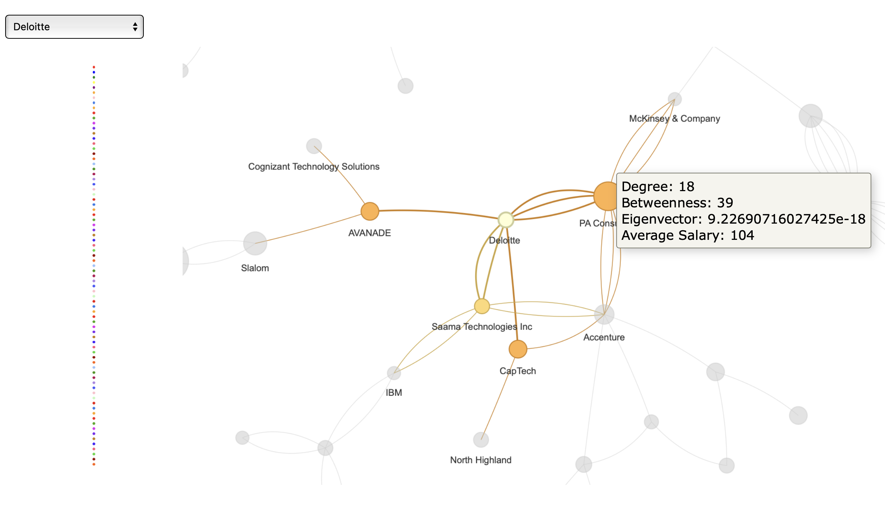

\newpage
# Einleitung

## Requirements
Zunächst müssen die benötigten Bibliotheken geladen werden:
```{r setup, message=FALSE, warning=FALSE}
library(tidyverse)
library(igraph)
library(visNetwork)
library(dplyr)
library(tidyr)
library(knitr)
library(kableExtra)
library(webshot)
library(ggplot2)
library(RColorBrewer)
library(skimr)
library(htmlwidgets)
```


## Motivation und Zielsetzung
Die fortschreitende Digitalisierung sowie der kontinuierlich steigende Einsatz datengetriebener
Technologien haben in den vergangenen Jahren zu einer exponentiellen Zunahme an Daten geführt. 
Es ist daher nicht verwunderlich, dass die Aussage "Data is the new Oil", die auf einen
Artikel im Economist aus dem Jahr 2017 zurückgeht^[Vgl. The Economist, „The world`s most valuable resource is no longer oil, but data“ 2017]
, zunehmend an Resonanz gewinnt. 
Es wird prognostiziert, dass die weltweite Datenmenge von 33 Zettabytes im Jahr 2018 auf 175 Zettabytes
im Jahr 2025 anwachsen wird^[Vgl. Rydning 2018, S. 3]
, was einem exponentiellen Wachstum entspricht.^[Vgl. Mahanti 2021, S. 6]
Die Herausforderung für Unternehmen besteht folglich darin, diese Datenmengen effizient zu verwalten, um
auf dieser Grundlage fundierte Entscheidungen treffen zu können.
Mit dem Aufkommen von Data Science als eigenständiger Disziplin und der Etablierung des Berufsbildes „Data Scientist“ wird das Potenzial der Datenanalyse in unterschiedlichen Bereichen zunehmend erkannt.^[Vgl. Stockinger/Stadelmann/Ruckstuhl 2016, S. 60]
$\\$
In ihrem Artikel "Data Scientist: The Sexiest Job of the 21st Century"
betonen Davenport und Patil, dass Data Scientists durch ihre Fähigkeiten in Informatik, 
Statistik und ihr Fachwissen allgemein einen erheblichen Mehrwert für Unternehmen schaffen.^[Vgl. Davenport/Patil 2012]
Die Fähigkeit, aus komplexen, unstrukturierten Daten wertvolle Erkenntnisse zu gewinnen, 
macht Data Scientisten in vielen Branchen zu einer unverzichtbaren Ressource.^[Vgl. Davenport/Patil 2012]
Die Nutzung ihrer Kompetenzen verschafft Unternehmen einen Wettbewerbsvorteil, 
da sie datengetriebene Entscheidungen, Produktinnovationen und Effizienzsteigerungen ermöglicht.^[Vgl. Davenport/Patil 2012]
$\\$
Darüber ob das Berufsbild Data Scientist immer noch the "Sexiest Job" des 21. Jahrhunderts ist, lässt sich streiten.
Fakt ist jedoch, dass die Nachfrage nach Data Scientists in den letzten Jahren stark gestiegen ist und 
vorraussichtlich immer weiter steigen wird. 
Dieser Trend ist auch in den Google-Suchanfragen zu den Begriffen erkenntlich:^[Google Trends, abgerufen am 30.10.2024]
```{r, include=FALSE} 

# Read the CSV file, skipping the first row
data <- read_csv("data/GOOGLE_SEARCH_DATA.CSV", skip = 1)

# Clean the data: Convert "<1" to 0.5 for plotting purposes
data <- data %>%
  mutate(`data science` = ifelse(`data science` == "<1", 0.5,
                                 as.numeric(`data science`)),
         `data scientist` = ifelse(`data scientist` == "<1", 0.5,
                                   as.numeric(`data scientist`)))

# Convert the 'Monat' column to Date type
data$Monat <- as.Date(paste0(data$Monat, "-01"))
```
```{r, fig.width=12, fig.height=6}

ggplot(data, aes(x = Monat)) +
  geom_line(aes(y = `data science`, color = "data science")) +
  geom_line(aes(y = `data scientist`, color = "data scientist")) +
  labs(title = "Google Suchtrend für 'data science' und 'data scientist'",
       x = "Datum",
       y = "Interesse",
       color = "Suchbegriff") +
  theme_minimal()
```
$\\$
Das wachsende Interesse an Data Science stellt eine große Chance für Arbeitnehmer dar. Ziel dieser Arbeit ist es
einen Überblick über den Data-Science-Jobmarkt zu geben, um Arbeitnehmern bei der Jobsuche zu helfen und
andererseits einen Überblick über die Gehälter und die Rolle von Geographie und Wettbewerb bei Jobangeboten und Gehältern zu geben.

## Forschungsfrage
Im Rahmen der vorliegenden Arbeit wird die folgende Forschungsfrage bearbeitet:

Es soll untersucht werden, inwiefern die Position und Zentralität von Unternehmen im Wettbewerbsnetzwerk die Gehaltsstrukturen von Data-Science-Positionen beeinflusst. 
Zudem soll erörtert werden, welche Rolle die Intensität des Wettbewerbs bei der Erklärung von Gehaltsunterschieden spielt.

Dabei sollen folgende Aspekte untersucht werden:

Bieten Unternehmen, die als zentrale Knoten in einem dichten Wettbewerbsnetzwerk agieren, tendenziell höhere Löhne an?
$\\$
Inwieweit beeinflusst die Clusterbildung im Netzwerk die Gehaltsstrukturen und gibt es spezifische Cluster, in denen höhere Gehälter häufiger angeboten werden?
$\\$
Welche Zentralitätsmaße korrelieren signifikant mit überdurchschnittlichen Gehältern und können Unternehmen mit bestimmten Netzwerkpositionen spezifische Wettbewerbsvorteile erzielen?


## Datengrundlage
Nachdem die Daten in Python extern als Vorbereitung aufbereitet wurden, kann nun die Datengrundlage für diese Arbeit in R eingelesen werden. 
Dabei wurde sich an https://www.kaggle.com/code/fahadrehman07/data-science-job-salary-prediction-glassdoor orientiert.

### CSV einlesen
```{r,}
data <- read_csv("data/Glassdoor_DataScience_Salary_modified.csv", show_col_types = FALSE)
```

Die vorliegende Arbeit basiert auf einem Datensatz von Kaggle, der Informationen über Data Science Jobs in verschiedenen Unternehmen für den US-amerikanischen Markt enthält. 
Der Datensatz umfasst 742 Zeilen und 28 Spalten, was auf eine Anzahl von 742 verschiedenen Jobangeboten hindeutet. 
Diese Anzahl ist kann für die Zwecke dieser Arbeit als ausreichend zu betrachten, auch wenn eine höhere Zahl an Beobachtungen möglicherweise zu präziseren Schlussfolgerungen geführt hätte.

Der Datensatz beruht auf Daten, die von Glassdoor extrahiert wurden, eine für Stellenanzeigen und Unternehmensbewertung bekannte Website, und bietet 
detaillierte Informationen über Data-Science-Jobs sowie deren Gehälter. Der Datensatz beinhaltet wesentliche Informationen, darunter Jobtitel, 
geschätzte Gehälter, Stellenbeschreibungen, Unternehmensbewertungen sowie relevante Unternehmensdaten wie Standort, Größe und Branche. 
Eine detaillierte Beschreibung dieser Daten erfolgt im späteren Verlauf. 
Der Datensatz eignet sich in besonderem Maße für den Zweck dieser Arbeit, aber auch für Analysen des Arbeitsmarktes, beispielsweise 
zur Untersuchung von Gehaltstrends oder zur Identifizierung der am besten bewerteten Unternehmen. 

Der Datensatz umfasst konkret die folgenden Spalten:

### Erste Ansicht der Daten
```{r, message=FALSE, warning=FALSE}
head(data, 5)

# Erstellen einer schönen Zusammenfassung des Datensatzes
skim(data)
```


Im Folgenden wird eine Übersicht der wesentlichen Spalten präsentiert:

- `Job Title`: Die Berufsbezeichnung, sie gibt Aufschluss über die Tätigkeit.
- `Salary Estimate`: Die geschätzte Gehalt, in tausend Dollar pro Jahr. Es basiert auf dem Durchschnitt von dem minimalen und maximalen Gehalt.
- `Job Description`, `Job_simp`: Die Beschreibung der Stelle, die Aufgaben und Anforderungen enthält. Auch die vereinfachte Version der Berufsbezeichnung.
- `Rating`: Die Bewertung des Unternehmens, sie weist eine Spannbreite von 1 bis 5 auf, wobei die Bewertung "-1" bei jeder Spalte für fehlende Bewertungen steht.
- `Company Name`, `Location`, `Headquarters`, `Size`, `Founded`: Unternehmensbezogene Daten wie Name, Standort, Sitz, Größe und Gründungsjahr des Unternehmens.
- `Type of ownership`, `Industry`, `Sector`, `Revenue`: Weitere Unternehmensmerkmale, diese umfassen die Eigentumsart, die Branche, den Sektor sowie die Einnahmen.
- `Competitors`: Die Wettbewerber des Unternehmens, die im Zusammenhang dieser Arbeit von besonderer Bedeutung sind.
- Skills (`Python_yn`, `R Studio`, `Spark`, `AWS_yn`, `Excel_yn`): Spalten, aus denen hervorgeht, ob die betreffende Kompetenz in der Stellenbeschreibung verlangt wird (0 = nein, 1 = ja).
- `Min_salary`, `Max_salary`: Minimale und maximale Gehaltsschätzungen.
- `State`, `Same State`, `job_state`, `Age`, `desc_len`, `Num_comp`: Zusätzliche Informationen wie Standort der Stelle, Alter des Unternehmens, Länge der Stellenbeschreibung und Anzahl der Mitbewerber.

Es zeigt sich, dass eine Vielzahl von Spalten für die vorliegende Untersuchung irrelevant ist. 
Infolgedessen werden in einem späteren Teil der Arbeit irrelevante Spalten, wie beispielsweise die Kenntnisse in Python, R Studio, Spark und ähnlichen Programmen, welche ursprünglich aus der Jobbeschreibung extrahiert wurden, entfernt.

Im Folgenden wird eine erste Betrachtung der Daten vorgenommen. Zu diesem Zweck werden die Jobs in New York nach ihren jeweiligen Vergütungen geordnet und in Form eines Balkendiagramms dargestellt.
```{r, fig.height=14}

# Filterung der Daten für New York
data_ny <- data %>%
  filter(State == "NY")

# Durchschnittsgehalt nach Berufsbezeichnung
avg_salary_by_job_ny <- data_ny %>%
  group_by(`Job Title`) %>%
  summarise(Average_Salary = mean(`Salary Estimate`, na.rm = TRUE)) %>%
  arrange(desc(Average_Salary))

# Bar Plot
ggplot(avg_salary_by_job_ny,
       aes(x = reorder(`Job Title`, Average_Salary), y = Average_Salary)) +
  geom_bar(stat = "identity") +
  coord_flip() +
  labs(title = "Average Salary by Job Title in NY",
       x = "Job Title",
       y = "Average Salary") +
  theme_minimal() +
  theme(
    axis.title = element_text(size = 14),
    axis.text = element_text(size = 12),
    plot.title = element_text(size = 16, face = "bold")
  )
```
Es lässt sich eine signifikante Variation der Gehälter in New York beobachten. 
Zudem zeigt sich eine Korrelation zwischen Höhe des Gehalts und der Position: Mit steigendem Einkommen nehmen die Anzahl und der Rang der Senior- und Managerpositionen zu.

_______________
Da die Datengrundlage nicht in einem igraph-Objekt vorliegt und ungerichtet ist, 
ist es notwendig Knoten, Kanten sowie relevante Attribute wie beispielsweise 
Gewichtungen zu definieren, um überhaupt Netzwerkvisualisierungen in R durchführen zu können.
Doch dazu mehr im nächsten Kapitel.


\newpage
# Analysestrategie

Im Rahmen meiner Analyse werde ich die verschiedenen Zentralitätsmaße zur Untersuchung der Position und Bedeutung von Unternehmen im Wettbewerbsnetzwerk heranziehen. 
Die Anwendung dieser Maße ermöglicht unterschiedlicher Einblicke in die strategische Verknüpfung von Unternehmen im Netzwerk sowie in die potenzielle Auswirkung dieser 
Verknüpfung auf die Gehaltspolitik und Attraktivität von Unternehmen im Data-Science-Bereich.

**1. Datenaufbereitung und Netzwerkerstellung**

In einem ersten Schritt wird ein Netzwerk aufgebaut, in dem jedes Unternehmen als Knoten dargestellt wird. 
Die Verbindungen zwischen den Knoten basieren auf der Spalte "Competitors". 
Dabei werden Unternehmen, die als Wettbewerber aufgeführt sind, durch eine Kante verbunden. 
Im nächsten Schritt erfolgt eine Aufbereitung der Daten. 
Dazu werden doppelte oder fehlerhafte Einträge entfernt sowie Unternehmensnamen standardisiert, 
um eine korrekte Kantenbildung zu gewährleisten.

**2. Berechnung von Netzwerkmetriken und Zentralitätsmaßen**

In der nächsten Phase erfolgt die Berechnung wichtiger Zentralitätsmetriken, welche die Bedeutung der einzelnen Unternehmen im Wettbewerbsnetzwerk bestimmen.
Die Betweenness-Zentralität ermöglicht die Identifikation von Unternehmen, die eine Brückenfunktion zwischen anderen Unternehmen einnehmen.
 Diese Unternehmen sind von entscheidender Bedeutung für die Kommunikation und den Austausch von Informationen innerhalb des Netzwerkes.
Die Degree-Zentralität gibt Aufschluss über die Anzahl direkter Wettbewerber, mit denen ein Unternehmen in Beziehung steht. 
Dies reflektiert die Wettbewerbsintensität und gibt Aufschluss über die Integration eines Unternehmens in das Wettbewerbsumfeld.
Die Eigenvektor-Zentralität demonstriert die besondere Einflussnahme von Unternehmen, welche durch eine exzellente Vernetzung mit anderen zentralen Wettbewerbern gekennzeichnet ist.

**3. Visualisierung und Strukturanalyse des Wettbewerbsnetzwerks**

Im Folgenden erfolgt eine Anwendung von Algorithmen zur Erkennung von Communities, wie beispielsweise Louvain, 
mit dem Ziel, Cluster innerhalb des Netzwerks zu identifizieren. Die Analyse zielt darauf ab, natürliche Gruppen von Unternehmen zu identifizieren, 
die durch intensive Wettbewerbsverhältnisse gekennzeichnet sind.
Des Weiteren erfolgt innerhalb der identifizierten Cluster eine Analyse der Gehaltsstrukturen 
sowie der Branchenzugehörigkeit, mit dem Ziel, etwaige Muster und Zusammenhänge zu identifizieren.

**4. Explorative Gehaltsanalyse im Netzwerk**

Abschließen wird im Rahmen einer explorativen Gehaltsanalyse dem Leser die Möglichkeit gegeben die Gehaltsstrukturen innerhalb des Netzwerkes gemeinsam mit den Zentralitätsmaßen selbstständig zu erforschen.


\newpage
# Analyse
## Datenbereinigung

### Bereinigung für die geografische Analysex
Bei der Durchsicht des Datensatzes viel auf, dass die Spalten "Same State" und "job_state" von der Logik her ähnlich sind.
Dies soll nun näher unterucht werden, um spätere Fehler, vor allem bei geografischen Netzwerken(siehe Anhang), vorzubeugen.
$\\$
```{r}
# Auswahl der "State" und "job_state" Spalten
selected_data <- data %>%
  select(State, job_state)

# Heading der ausgewählten Spalten
head(selected_data, 15)
```

Es scheint, dass beide Spalten identisch sind. Diesbezüglich ist jedoch eine Prüfung erforderlich.
$\\$

```{r}
if (all(selected_data$State == selected_data$job_state, na.rm = TRUE)) {
  print("Alle Werte in 'State' und 'job_state' sind identisch.")
} else {
  print("Es gibt Unterschiede zwischen 'State' und 'job_state'.")
}
```

Diese Annahme erweist sich jedoch als unzutreffend, da sich in der Tat Unterschiede feststellen lassen.
$\\$

```{r}
# Auswahl der Zeilen, in denen "State" und "job_state" unterschiedlich sind
different_states <- selected_data %>%
  filter(State != job_state)

print(different_states, n = Inf)
```

Es fällt auf, dass LA und Los Angeles nicht einheitlich verwendet werden. Außerdem ist Los Angeles kein eigener Bundesstaat, sondern ein Teil von Kalifornien (CA). Dies sollte korrigiert werden.
$\\$
Außerdem sollte bei der weiteren Vorgehensweise darauf geachtet werden, dass Werte wie "Na" oder "-1" vor den Auswertungen entfernt werden.
$\\$

```{r}
# Ersetzen von "Los Angeles" durch "LA" und "LA" durch "CA"
data <- data %>%
  mutate(State = ifelse(State == "Los Angeles", "LA", State),
         job_state = ifelse(job_state == "Los Angeles", "LA", job_state))

data <- data %>%
  mutate(State = ifelse(State == "LA", "CA", State),
         job_state = ifelse(job_state == "LA", "CA", job_state))

# Erneute Überprüfung
selected_data <- data %>%
  select(State, job_state)

if (all(selected_data$State == selected_data$job_state, na.rm = TRUE)) {
  print("Alle Werte in 'State' und 'job_state' sind identisch.")
} else {
  print("Es gibt Unterschiede zwischen 'State' und 'job_state'.")
}
```

### Überprüfung auf weitere fehlende Werte

Im nächsten Schritt wird der Datensatz auf weitere fehlende Werte überprüft, um sicherzustellen, dass keine fehlerhaften Daten in die Analyse einfließen.
$\\$

```{r}
# Überprüfen auf NA-Werte
na_counts <- colSums(is.na(data))

# Anzahl der NA-Werte pro Spalte:
print(na_counts)

# Überprüfen auf "na"-Werte (kleingeschrieben)
na_string_counts <- sapply(data, function(x) sum(tolower(x) == "na", na.rm = TRUE))

# Anzahl der "na"-Werte pro Spalte:
print(na_string_counts)

# Überprüfen auf -1-Werte
neg_one_counts <- sapply(data, function(x) sum(x == -1, na.rm = TRUE))

# Anzahl der -1 Werte in der Spalte Competitors
print(neg_one_counts)
```
$\\$
Es zeigt sich, dass lediglich in der Spalte "Competitors" relevante negative Werte zu finden sind, welche nun entfernt werden müssen. Die "na"-Werte in der Spalte "Job_simp" hingegen haben keinen Einfluss auf die Analyse.
$\\$

```{r}
# Entfernen von Zeilen mit -1 Werten in der Spalte "Competitors"
data <- data %>%
  filter(Competitors != -1)

# Überprüfen auf -1-Werte nach Entfernung
neg_one_counts <- sapply(data, function(x) sum(x == -1, na.rm = TRUE))
# Anzahl der -1 Werte pro Spalte:
print(neg_one_counts)
```

### Entfernen irrelevanter Spalten

In einem nächsten Schritt werden auf Basis der zuvor festgelegten Analysestrategie sowie der geplanten Analysen diejenigen Spalten identifiziert, die für die Analysen nicht erforderlich sind und anschließend entfernt.
$\\$

```{r}
# Entfernen irrelevanter Spalten
data <- data %>%
  select(-c(`Job Description`, Rating, Headquarters, Size, Founded,
            `Type of ownership`, Sector, Revenue, Python_yn,
            `R Studio`, Spark, AWS_yn, Excel_yn, desc_len, Num_comp))

# Ausgeben der noch enthaltenen Spalten
print(data %>% names())

```


### Bereinigung irrelevanter Jobtitel
Im Rahmen dieser Arbeit erfolgt eine Analyse von Gehältern und Wettbewerbsbeziehungen für den Data-Science-Jobmarkt.
Dabei ist zu überprüfen, ob alle Spalten tatsächlich konkrete Data-Science-Jobs repräsentieren.

Bei einer ersten Betrachtung des in der Einleitung präsentierten Balkendiagramms wird ersichtlich, 
dass eine Reihe von Jobtiteln nicht unmittelbar mit dem Bereich der "Data Science" assoziiert werden können.
$\\$


```{r}
# ausgeben alles uniqeuen Job Title und Job_simp
print(data %>% select(`Job Title`, `Job_simp`) %>% unique())
```


Es lässt sich feststellen, dass der Datensatz auch eine Reihe von Jobs von Wissenschaftlern umfasst, 
die nicht unmittelbar mit Data Science assoziiert werden.
Diese Jobs sind zudem nicht mit einem vereinfachten Jobtitel ("Job_simp") versehen, der auf eine Tätigkeit im Bereich Data Science hinweist.
Daher ist es erforderlich, alle Datensätze mit na-Werten in der Spalte "Job_simp" zu eliminieren.
Diese besutzen auch eine andere Schreibweise, deswegen wurden sie nicht direkt entfernt.
$\\$

```{r}
# Entfernen von Zeilen mit NA-Werten in der Spalte "Job_simp"
data <- data %>%
  filter(Job_simp != "na")

# Überprüfen auf "na"-Werte in der Spalte "Job_simp"
na_job_simp <- sum(data$Job_simp == "na")

print(paste("Anzahl der 'na'-Werte in der Spalte 'Job_simp':", na_job_simp))

print("Alle verbleibenden Jobtitel:")
print(data %>% select(`Job Title`, Job_simp) %>% unique())
```

Nachdem die Bereinigung des Datensatzes nun abgeschlossen ist, kann mit der Analyse begonnen werden.
$\\$

## Wettbewerbsnetzwerk
In diesem Abschnitt wird mit der eigentlichen Analyse, dem Ziel dieser Arbeit, der Erstellung einer Wettbewerbsanalyse begonnen.

### Erstellung eines Wettbewerbsnetzwerkes
Zu diesem Zweck wird ein Netzwerk erstellt, das auf den Wettbewerbsbeziehungen zwischen Unternehmen basiert. 

Die Wettbewerbsbeziehungen werden anhand der in der Spalte "Competitors" aufgeführten Unternehmen definiert.
Die Punkte im Netzwerk repräsentieren die Unternehmen, während die Kanten die Wettbewerbsbeziehungen zwischen ihnen darstellen.

Die Gewichtung der Kanten erfolgt wie folgt:

- Direkte Wettbewerber erhalten eine Gewichtung von 1.
- Unternehmen in derselben Branche, jedoch nicht als direkte Wettbewerber aufgeführt, erhalten eine Gewichtung von 0.5.

Branchenbezogene Wettbewerbsbeziehungen sind in blau dargestellt, während direkte Wettbewerber in rot hervorgehoben sind.

```{r, fig.height=15, fig.width=15}
# Extrahiere Unternehmen und ihre Wettbewerber
edges <- data %>%
  separate_rows(Competitors, sep = ", ") %>%
  select(`Company Name`, Competitors) %>%
  rename(from = `Company Name`, to = Competitors) %>%
  mutate(weight = 1)  # Gewichtung für direkte Wettbewerber

# Füge Unternehmen in derselben Branche mit Gewichtung 0.5 hinzu
industry_edges <- data %>%
  select(`Company Name`, Industry) %>%
  inner_join(
    data %>% select(`Company Name`, Industry),
    by = "Industry",
    relationship = "many-to-many"
  ) %>%
  filter(`Company Name.x` != `Company Name.y`) %>%
  select(from = `Company Name.x`, to = `Company Name.y`) %>%
  mutate(weight = 0.5)  # Gewichtung für gleiche Branche

# Kombiniere beide Datensätze
all_edges <- bind_rows(edges, industry_edges)

# Erstelle den Graphen
g_competitors <- graph_from_data_frame(all_edges, directed = FALSE)

# Entferne mehrere Kanten zwischen denselben Punkten
g_competitors <- simplify(g_competitors, remove.multiple = TRUE,
                          edge.attr.comb = "first")

# Setze die Farben der Kanten basierend auf der Gewichtung
E(g_competitors)$color <- ifelse(E(g_competitors)$weight == 1, "red", "blue")

# Visualisiere das Netzwerk mit kleineren Knoten
plot(g_competitors, vertex.label = NA,
     vertex.size = 2,  # Kleinere Knoten
     edge.width = E(g_competitors)$weight,  # Gewichtung der Kanten
     edge.arrow.size = 0.5,  # Kleinere Pfeile
     layout = layout_with_fr)

title(main = "Unternehmensnetzwerk basierend auf Wettbewerbern und Branchen",
      cex.main = 2)


# Legende für Kantenfarben
legend("topright", legend = c("Direct Competitors", "Same Industry"),
       fill = c("red", "blue"))
```
Es lassen sich einige interessante Beobachtungen aus dem Netzwerk ziehen.
Einerseits sind ganz eindeutig Branchencluster zu erkennen, die auf die Branchenzugehörigkeit der Unternehmen hinweisen.

```{r}
# Ausgeben der 10 häufigsten Branchen im Netzwerk
top_industries <- data %>%
  count(Industry, sort = TRUE) %>%
  head(10)

# Welche Unternehmen sind in mehreren Branchen vertreten?
multi_industry_companies <- data %>%
  group_by(`Company Name`) %>%
  summarise(Num_Industries = n_distinct(Industry)) %>%
  filter(Num_Industries > 1) %>%
  arrange(desc(Num_Industries))

# Sind Unternehmen enthalten, die in mehreren Branchen vertreten sind?
if (nrow(multi_industry_companies) == 0) {
  print("Keine Unternehmen in mehreren Branchen vertreten.")
} else {
  print("Unternehmen in mehreren Branchen vertreten.")
}
```
Jedoch sind keine Unternehmen in mehreren Branchen vertreten, was darauf hindeutet, dass die Branchenzugehörigkeit eindeutig ist.
Aber es gibt einige Unternehmen, die mit direkter Konkurrenz die verschiedenen Branchen verbinden. 
Dies könnte auf eine Diversifikation der Geschäftsfelder hindeuten, die eine breitere Wettbewerbsbasis schafft.

Da aber wie oberhalb dargestellt, die Branchenzugehörigkeit eindeutig ist, und somit die Branchenzugehörigkeit
keinen Mehrwert für die Analyse bietet, wird diese nicht weiter verfolgt.


### Betrachtung fokussiert auf direkte Wettbewerber
Aus diesem Grund wird das Netzwerk auf direkte Wettbewerber beschränkt, um die Analyse zu vereinfachen und die Relevanz der Wettbewerbsbeziehungen zu erhöhen.
$\\$

```{r, fig.width=15, fig.height=15}
# Extrahiere Unternehmen und ihre Wettbewerber
edges <- data %>%
  separate_rows(Competitors, sep = ", ") %>%
  select(`Company Name`, Competitors) %>%
  rename(from = `Company Name`, to = Competitors) %>%
  mutate(weight = 1)  # Gewichtung für direkte Wettbewerber

# Summiere die Gewichtungen für mehrere Kanten zwischen denselben Punkten
edge_weights <- edges %>%
  group_by(from, to) %>%
  summarise(weight = sum(weight), .groups = 'drop')

# Erstelle den Graphen nur mit direkten Wettbewerbern
g_direct_competitors <- graph_from_data_frame(edge_weights, directed = FALSE)

# Setze die Gewichtungen der Kanten im Graphen
E(g_direct_competitors)$weight <- edge_weights$weight

# Füge die Gehaltsdaten hinzu und berechne das durchschnittliche Gehalt pro Unternehmen
salary_data <- data %>%
  group_by(`Company Name`) %>%
  summarise(AverageSalary = mean(`Salary Estimate`, na.rm = TRUE))

# Füge die Gehaltsdaten zu den Knoten des Graphen hinzu
company_names <- V(g_direct_competitors)$name
average_salaries <- salary_data$AverageSalary
company_indices <- match(company_names, salary_data$`Company Name`)
V(g_direct_competitors)$salary <- average_salaries[company_indices]

# Setze fehlende Gehaltsdaten auf einen speziellen Wert (z.B. 0)
V(g_direct_competitors)$salary[is.na(V(g_direct_competitors)$salary)] <- 0

# Definiere die Gehaltsspektren
salary_breaks <- c(-Inf, 50, 80, 100, 150, Inf)
salary_labels <- c("Lowest Salary", "Low Salary", "Medium Salary", "High Salary",
                   "Highest Salary")

# Setze die Farben der Knoten basierend auf den Gehältern
color_palette <- brewer.pal(5, "YlOrRd")
V(g_direct_competitors)$color <- cut(V(g_direct_competitors)$salary,
                                     breaks = salary_breaks,
                                     labels = FALSE, 
                                     include.lowest = TRUE)
V(g_direct_competitors)$color <- color_palette[V(g_direct_competitors)$color]

# Setze die Farben der Kanten basierend auf der Gewichtung
E(g_direct_competitors)$color <- "red"

# Visualisiere das Netzwerk mit kleineren Knoten
plot(g_direct_competitors, vertex.label = NA,
     vertex.size = 3,  # Kleinere Knoten
     edge.width = 1 * E(g_direct_competitors)$weight,# Reduzierte Gewichtung der Kanten
     edge.arrow.size = 1,
     layout = layout_with_fr
)
title(main = "Unternehmensnetzwerk basierend auf direkten Wettbewerbern", cex.main = 2)

# Legende für Knotenfarben
legend("topright", legend = salary_labels,
       fill = color_palette)

# Ausgabe der Gehälter der Unternehmen
salary_data <- data %>%
  group_by(`Company Name`) %>%
  summarise(AverageSalary = mean(`Salary Estimate`, na.rm = TRUE)) %>%
  arrange(desc(AverageSalary))

# Ausgabe der 10 Unternehmen mit den höchsten Gehältern
print(salary_data, n = 10)

# Konkrete Gehaltsspektren für die jeweilige Färbung
print("Gehaltsspektren für die jeweilige Färbung:")
print(salary_breaks)
```

Das Unternehmensnetzwerk demonstriert die engen Verbindungen zwischen Unternehmen, die auf direkten Wettbewerbsbeziehungen basieren, 
und stellt dabei die Gehälter der Unternehmen heraus. Die Farbe der Knoten variiert entsprechend den Gehaltsniveaus. 
Dabei werden niedrige Gehälter durch hellgelb und höhere Gehälter durch rote bsi dunkelrote Farben symbolisiert.

In der Mitte des Netzwerks lassen sich einige Unternehmen mit hohen Gehältern und zahlreichen Verbindungen ausmachen, 
die eine zentrale Lage einnehmen (dunkelrot). 
Es lässt sich vermuten, dass diese Unternehmen eine zentrale Rolle im Wettbewerbsnetzwerk einnehmen. 
Dies könnte darauf hindeuten, dass sie dominierende Marktakteure oder wichtige Branchenführer sind.

Das Netzwerk ist gekennzeichnet durch eine Vielzahl kleinerer, weniger vernetzter Unternehmenscluster, die tendenziell niedrigere Gehälter zahlen (hellere Farben). Die Präsenz peripherer Gruppen könnte darauf hinweisen, dass es sich um Nischenmärkte oder weniger stark umkämpfte Branchen handelt.

Allgemein lässt sich jedoch feststellen, dass Unternehmen die sich in einer zentraleren Positionen innerhalb ihres Clusters befinden, 
im Durchschnitt deutlich höhere Gehälter anbieten. 
Dies lässt den Schluss zu, dass eine stärkere Wettbewerbsposition sowie eine höhere Attraktivität für qualifizierte Arbeitskräfte gegeben sind.

## Zentralitätsanalyse innerhalb des Netzwerkes

Die hier präsentierten Zentralitätsmaße lassen sich unmittelbar auf die Gehaltsstrukturen im Kontext des Wettbewerbsnetzwerks anwenden.
Auf diese Weise könnten sie dazu beitragen, die Position eines Unternehmens in Bezug auf seine Wettbewerber hinsichtlich der Gehälter zu bestimmen.
$\\$
Folgend wird die Berechnung der Zentralitätsmaße für die Unternehmen im Wettbewerbsnetzwerk dargelegt.
$\\$
```{r}
# Datenauswahl für die Zentralitätsanalyse
selected_data <- data %>%
  select(`Company Name`, Competitors, `Salary Estimate`)

# Extrahiere Unternehmen und ihre Wettbewerber
edges <- selected_data %>%
  separate_rows(Competitors, sep = ", ") %>%
  select(`Company Name`, Competitors) %>%
  rename(from = `Company Name`, to = Competitors)

# Erstelle den Graphen
g_competitors_zentralität <- graph_from_data_frame(edges, directed = FALSE)


# Berechne die Zentralitätsmaße für die Knoten
degree_centrality <- degree(g_competitors_zentralität, mode = "all")
betweenness_centrality <- betweenness(g_competitors_zentralität, directed = FALSE)
eigenvector_centrality <- evcent(g_competitors_zentralität, directed = FALSE)
```

### Betweenness-Zentralität
Jetzt soll das igraph-Paket in R verwendet werden, um die Betweenness-Zentralität für jeden Knoten zu berechnen.
Unternehmen mit hoher Betweenness-Centralität könnten strategische Wettbewerbsvorteile aufweisen, 
da sie als Vermittler zwischen mehreren Konkurrenten fungieren und dadurch den Informationsfluss beeinflussen können.
$\\$
Die Unternehmen könnten höhere Gehälter anbieten, um hochqualifizierte Arbeitskräfte zu gewinnen, die dazu beitragen,
ihre zentrale Position und die damit verbundenen Wettbewerbsvorteile zu erhalten.
Alternativ könnte ein hohes Gehalt auch als Indikator für eine hohe Nachfrage nach qualifizierten Mitarbeitenden 
in solchen Schlüsselpositionen dienen, da das Unternehmen sich in einem Bereich positioniert, der viele strategische Informationen benötigt.

```{r}
# Berechne die Betweenness-Centrality und sortiere sie absteigend
top_betweenness <- head(sort(betweenness_centrality, decreasing = TRUE), 5)

# Erstelle ein DataFrame mit den Namen der Unternehmen und ihrer Betweenness-Centrality
top_betweenness_df <- data.frame(
  Company = names(top_betweenness),
  Betweenness = as.numeric(top_betweenness),
  stringsAsFactors = FALSE
)

# Erstellen einer Tabelle
kable(top_betweenness_df, format = "latex", booktabs = TRUE, align = "l") %>%
kable_styling(latex_options = c("striped", "hold_position"), position = "left")
```
$\\$

```{r}

# Zusammenhang zwischen durchschnittliches Gehalt und Betweenness-Zentralität
salary_betweenness <- data.frame(
  Salary = salary_data$AverageSalary,
  Betweenness = betweenness_centrality[
    match(salary_data$`Company Name`, names(betweenness_centrality))
  ]
)

# Scatterplot mit roter, gestrichelter Trendlinie
ggplot(salary_betweenness, aes(x = Salary, y = Betweenness)) +
  geom_point() +
  geom_smooth(method = "loess", se = FALSE, color = "red", linetype = "dashed") +
  labs(title = "Scatterplot of Salary vs. Betweenness Centrality",
       x = "Salary", y = "Betweenness Centrality") +
  theme_minimal() +
  theme(
    plot.title = element_text(size = 14, face = "bold"),
    axis.title = element_text(size = 12, face = "bold"),
    axis.text = element_text(size = 12)
  )
```
Der Scatterplot veranschaulicht die Korrelation zwischen dem Gehalt auf der x-Achse und der Betweenness Centrality auf der y-Achse.
Die rote Linie zeigt einen nichtlinearen Trend zwischen Gehalt und Betweenness Centrality, was auf eine mögliche Korrelation hinweisen könnte, insbesondere bei höheren Gehältern.

Die Mehrzahl der Unternehmen weist eine geringe Betweenness Centrality auf, wobei die Höhe der Vergütung eine eher untergeordnete Rolle spielt. 
Allerdings lässt sich eine Ausnahmen beobachten. 
Ab ca. 150k Dollar auf der Gehaltsachse zeigt der Trend einen deutlichen Anstieg der Betweenness Centrality.
Dies könnte bedeuten, dass Unternehmen mit sehr hohen Gehältern tendenziell auch höhere Betweenness Centrality Werte aufweisen und somit eine wichtige Vermittlerrolle im Netzwerk einnehmen. 
Jedoch wird dieser Antieg bloß von einem Unternehmen repräsentiert, was auf eine Ausnahme hinweisen könnte.
Dieses Unternehmen könnten jedoch ein besonders attraktiver Arbeitgeber für strategische Schlüsselpositionen sein und durch hohe Gehälter zusätzlich Talente anziehen.

Allgemiens lässt dies den Schluss zu, dass bestimmte Unternehmen eine zentrale Vermittlerrolle im Netzwerk einnehmen, 
ohne zwangsläufig die höchsten Gehälter zu offerieren.

Die wenigen Unternehmen mit einer sehr hohen Betweenness Centrality könnten als strategische Vermittler im Markt auftreten und 
dabei möglicherweise andere Vorteile nutzen, anstatt ihre Gehälter zu erhöhen.
Die dargelegte Erkenntnis lässt die Hypothese zu, dass Unternehmen, 
die über zahlreiche Verbindungen im Wettbewerbsnetzwerk verfügen, 
ihre Attraktivität nicht allein durch monetäre Zuwendungen, sondern auch durch andere Vorteile oder Reputation aufrechterhalten könnten. 
Für hochspezialisierte Unternehmen, die in einer Nische tätig sind und weniger Konkurrenz haben, 
könnte es sich lohnen, gezielt in Gehälter zu investieren, um Talente anzuziehen.


Im folgenden Schritt soll sich der Außreißer mit dem höchsten Gehalt und der zweithöchsten Betweenness Centrality genauer betrachtet werden.
```{r}
# Unternehmen mit dem höchsten Gehalt und der zweithöchsten Betweenness Centrality
outlier <- salary_betweenness %>%
  filter(Salary > 210 & Betweenness > 0.0001)

# Ausgabe des Unternehmens
print(outlier)
```
$\\$
Das Unternehmen mit dem höchsten Gehalt und der zweithöchsten Betweenness Centrality ist "Gallup".
$\\$
```{r}
# Berechne die Nachbarn von "Gallup"
gallup_neighbors <- neighbors(g_direct_competitors, "Gallup", mode = "all")

# Erstelle ein DataFrame mit den Namen der direkten Wettbewerber von "Gallup"
gallup_neighbors_df <- data.frame(
  Competitors = names(gallup_neighbors),
  stringsAsFactors = FALSE
)

# Erstelle eine schön formatierte Tabelle im LaTeX-Format
kable(gallup_neighbors_df, format = "latex", booktabs = TRUE, align = "l") %>%
  kable_styling(latex_options = c("striped", "hold_position"), position = "left") %>%
  column_spec(1, width = "5cm")
```

$\\$
"Gallup" hat 3 direkte Wettbewerber: "Booz Allen Hamilton", "Advisory Board" und "McKinsey & Company".
Daraus lässt sich schließen, dass "Gallup" eine zentrale Vermittlerrolle zwischen diesen drei Unternehmen einnimmt,
was durch die hohe Betweenness Centrality und das hohe Gehalt reflektiert wird.

### Degree-Zentralität
Hier wird die Anzahl der Kanten gezählt, die an jedem Knoten hängen. 
Hohe Werte können auf starke Verbindungen zu anderen Unternehmen hinweisen.
Unternehmen mit hoher Degree Centrality sind also in einem besonderem Maße der Konkurrenz 
durch eine Vielzahl anderer Firmen ausgesetzt, was zu einem hohen Druck innerhalb der Branche führen kann.

Ein hoher Degree Centrality-Wert lässt die Vermutung zu, dass es sich um ein Unternehmen handelt, 
welches sich durch höhere Gehälter von der Konkurrenz abheben und somit Talente anwerben möchte. 
Andererseits besteht für Unternehmen in stark besetzten Märkten die Möglichkeit, durch Maßnahmen 
wie eine attraktive Arbeitskultur oder Weiterbildungsmöglichkeiten für Mitarbeiter, trotz eines 
geringeren Gehalts, für Bewerber attraktiver zu sein. In diesem Fall können Unternehmen mit mittleren 
oder niedrigeren Degree-Centrality-Werten im Vergleich attraktivere Gehälter bieten, da sie weniger 
Wettbewerbsdruck haben und gezielt in Gehälter investieren können.
```{r}
# Berechne die Degree-Centrality und sortiere sie absteigend
top_degree <- head(sort(degree_centrality, decreasing = TRUE), 5)

# Erstelle ein DataFrame mit den Namen der Unternehmen und ihrer Degree-Centrality
top_degree_df <- data.frame(
  Company = names(top_degree),
  Degree = as.numeric(top_degree),
  stringsAsFactors = FALSE
)

# Erstelle die Tabelle und zentriere sie links
kable(gallup_neighbors_df, format = "latex", booktabs = TRUE, align = "l") %>%
  kable_styling(latex_options = c("striped", "hold_position"), position = "left")
```
$\\$

```{r}
# Zusammenhang zwischen durchschnittliches Gehalt und Degree-Zentralität
salary_degree <- data.frame(
  Salary = salary_data$AverageSalary,
  Degree = degree_centrality[match(salary_data$`Company Name`, names(degree_centrality))]
)

# Scatterplot
ggplot(salary_degree, aes(x = Salary, y = Degree)) +
  geom_smooth(method = "loess", se = FALSE, color = "red", linetype = "dashed") +
  geom_point() +
  labs(title = "Scatterplot of Salary vs. Degree Centrality",
       x = "Salary", y = "Degree Centrality") +
  theme_minimal() +
  theme(
    plot.title = element_text(size = 14, face = "bold"),
    axis.title = element_text(size = 12, face = "bold"),
    axis.text = element_text(size = 12)
  )
```
Die rote Linie zeigt einen flachen Trend ohne starke Korrelation in diesem Scatterplot zwischen Gehalt und Degree Centrality.

Der weitgehend flache Verlauf der Trendlinie lässt den Schluss zu, dass kein klarer Zusammenhang zwischen der Degree Centrality und den Gehältern besteht.
Dies könnte implizieren, dass die Anzahl direkter Wettbewerber ( Degree Centrality) für sich genommen keinen signifikanten Einfluss auf das Gehaltsniveau eines Unternehmens ausübt.

Ein kleiner Anstieg des Gehalts ist insbesondere im Bereich zwischen 100 und 150 zu verzeichnen, was darauf hindeutet, dass Unternehmen mit mittlerem Gehaltsniveau tendenziell mehr direkte Wettbewerber haben. Diese Entwicklung lässt sich dadurch erklären, dass Unternehmen mit mittleren Gehaltsniveaus in stärker besetzten Märkten tätig sind, in denen eine größere Anzahl an Unternehmen um Talente konkurriert.

Die meisten Werte der Degree Centrality sind relativ niedrig, was darauf hindeutet, dass eine Vielzahl von Unternehmen lediglich eine geringe Anzahl direkter Wettbewerber aufweist. Einige Unternehmen mit hoher Degree Centrality und niedrigen bis mittleren Gehältern heben sich jedoch von der Gesamtheit ab. Es ist möglich, dass diese Unternehmen in stark umkämpften Märkten tätig sind, jedoch nicht über die erforderlichen Ressourcen verfügen, um hohe Gehälter zu offerieren.

Ein Vergleich der Degree Centrality mit der Betweenness Centrality zeigt, dass die Degree Centrality einen geringeren Einfluss auf das Gehalt zu haben scheint. Dies lässt den Schluss zu, dass nicht die Anzahl der direkten Wettbewerber, sondern die Position eines Unternehmens als strategischer Vermittler im Netzwerk (Betweenness) einflussreicher für die Höhe des Gehalts ist.

### Eigenvector-Zentralität
Unternehmen mit hoher Eigenvector Centrality stehen nicht nur in Konkurrenz zu einer Vielzahl von Unternehmen, 
sondern insbesondere zu besonders einflussreichen Wettbewerbern im Netzwerk.

Unternehmen mit hoher Eigenvector Centrality könnten in der Konsequenz wettbewerbsfähige Gehälter anbieten müssen, 
um sich im Wettbewerb mit zentralen und attraktiven Arbeitgebern zu behaupten. 
Folglich sind auch die umliegenden Firmen gezwungen, ihre Angebote anzupassen, um für die Talente am Arbeitsmarkt attraktiv zu bleiben. 
Es besteht die Möglichkeit, dass diese Unternehmen die Gehälter für spezifische, wettbewerbsrelevante Rollen erhöhen, 
um den Marktstandards und den Anforderungen eines zentralen Wettbewerbsnetzwerks gerecht zu werden.

```{r}
# Berechne die Eigenvector-Centrality und sortiere sie absteigend
top_eigenvector <- head(sort(eigenvector_centrality$vector, decreasing = TRUE), 5)

# Erstelle ein DataFrame mit den Namen der Unternehmen und ihrer Eigenvector-Centrality
top_eigenvector_df <- data.frame(
  Company = names(top_eigenvector),
  Eigenvector = as.numeric(top_eigenvector),
  stringsAsFactors = FALSE
)

# Erstelle die Tabelle und zentriere sie links
kable(top_eigenvector_df, format = "latex", booktabs = TRUE, align = "l") %>%
  kable_styling(latex_options = c("striped", "hold_position"), position = "left")
```
$\\$

```{r}
# Berechne die Eigenvector-Centrality und sortiere sie absteigend
eigenvector_centrality <- evcent(g_competitors_zentralität, directed = FALSE)$vector

# Zusammenhang zwischen durchschnittliches Gehalt und Eigenvector-Zentralität
salary_eigenvector <- data.frame(
  Salary = salary_data$AverageSalary,
  Eigenvector = eigenvector_centrality[
    match(salary_data$`Company Name`, names(eigenvector_centrality))
  ]
)

# Entferne NA-Werte, die durch fehlende Übereinstimmungen entstehen könnten
salary_eigenvector <- na.omit(salary_eigenvector)

# Scatterplot mit roter, gestrichelter Trendlinie
ggplot(salary_eigenvector, aes(x = Salary, y = Eigenvector)) +
  geom_point() +
  geom_smooth(method = "loess", se = FALSE, color = "red", linetype = "dashed") +
  labs(title = "Scatterplot of Salary vs. Eigenvector Centrality",
       x = "Salary", y = "Eigenvector Centrality") +
  theme_minimal() +
  theme(
    plot.title = element_text(size = 14, face = "bold"),
    axis.title = element_text(size = 12, face = "bold"),
    axis.text = element_text(size = 12)
  )
```
Auch im Scatterplot zwischen Gehalt und Eigenvector Centrality lässt sich ein weitgehend flacher Trend beobachten, wie die rote Linie veranschaulicht. 
Der Eigenvector Centrality-Index misst die Intensität der Verbindungen zwischen einem Unternehmen und anderen, stark vernetzten Unternehmen. 

Die rote Linie verbleibt nahe dem Nullpunkt, was darauf hindeutet, dass die Eigenvector Centrality keine eindeutige Korrelation mit dem Gehalt aufweist. 
Diese Erkenntnis lässt den Schluss zu, dass Unternehmen, die mit anderen stark vernetzten Firmen assoziiert sind, nicht zwangsläufig höhere Gehälter zahlen.

Es lassen sich zwei Ausreißer identifizieren, die eine überdurchschnittlich hohe Eigenvector-Centrality-Wertigkeit aufweisen, 
obwohl sie vergleichsweise niedrige Gehälter zahlen. Es besteht die Möglichkeit, dass diese Unternehmen in hohem Maße mit anderen gut vernetzten Firmen verbunden sind, 
jedoch dennoch niedrigere Gehälter zahlen. Dies lässt den Schluss zu, dass die zentrale Vernetzung der Unternehmen im Wettbewerbsnetzwerk nicht ausreicht, 
um höhere Gehälter zu rechtfertigen, oder dass sie in einem stark vernetzten, aber niedrig bezahlten Segment tätig sind.

Die Analyse der Gehälter in Unternehmen mit hohen Vergütungen zeigt, dass diese sehr niedrige Werte in der Eigenvector-Centrality aufweisen. 
Dies lässt den Schluss zu, dass hohe Gehälter eher bei Unternehmen vorkommen, die weniger stark an andere hoch vernetzte Firmen im Netzwerk gebunden sind. 
Diese Unternehmen könnten eine besondere Marktstellung oder Spezialisierung aufweisen, welche ihnen erlaubt, hohe Gehälter zu zahlen, ohne auf enge Verbindungen zu anderen zentralen Unternehmen angewiesen zu sein.


## Cluster-Analyse
Die Anwendung von Community-Detection-Methoden, wie beispielsweise Louvain oder Walktrap, ermöglicht die Identifikation von Clustern von Unternehmen, die sich durch einen besonders engen Wettbewerb auszeichnen.

Im Rahmen der Klassifizierung und Visualisierung erfolgt eine farbliche Markierung der identifizierten Cluster im Netzwerk, um eine bessere Übersicht über die Wettbewerbsgruppen zu gewinnen.

Im Rahmen der Untersuchung wird ermittelt, ob Cluster existieren, in denen besonders hohe oder niedrige Gehälter überwiegen, und ob diese Cluster eine gemeinsame Markt- oder Branchenstruktur aufweisen.

### Clustering Identifikation

```{r, fig.width=11, fig.height=11}
# Louvain Community Detection
louvain_community <- cluster_louvain(g_direct_competitors, resolution = 0.1)

# Walktrap Community Detection
walktrap_community <- cluster_walktrap(g_direct_competitors, steps = 2)

# Wähle Louvain als Community-Detection-Methode
communities <- louvain_community


# Füge die Community-Informationen zu den Knoten des Graphen hinzu
V(g_direct_competitors)$community <- membership(communities)

# Erstelle eine Farbpalette für die Communities
num_communities <- length(unique(V(g_direct_competitors)$community))
if (num_communities > 12) {
  community_colors <- colorRampPalette(brewer.pal(12, "Set3"))(num_communities)
} else {
  community_colors <- brewer.pal(num_communities, "Set3")
}

# Weise die Farben den Knoten basierend auf ihrer Community zu
V(g_direct_competitors)$color <- community_colors[V(g_direct_competitors)$community]

# Visualisiere das Netzwerk mit den Community-Farben
plot(g_direct_competitors, vertex.label = NA,
     vertex.size = 3,  # Kleinere Knoten
     edge.width = 1 * E(g_direct_competitors)$weight, # Reduzierte Gewichtung der Kanten
     edge.arrow.size = 1,
     layout = layout_with_fr,
)
title(main = "Unternehmensnetzwerk mit Community-Detection (Louvain)", cex.main = 2)
```


```{r}
# Berechne die Größe der Cluster
cluster_sizes <- table(membership(communities))

# Sortiere die Cluster nach Größe absteigend
sorted_clusters <- sort(cluster_sizes, decreasing = TRUE)

# Erstelle ein DataFrame mit den Cluster-Informationen
cluster_info <- data.frame(
  Cluster = names(sorted_clusters),
  Size = as.numeric(sorted_clusters),
  stringsAsFactors = FALSE
)

# Ausgeben wie viele Cluster es gibt
print(paste("Anzahl der Cluster:", length(cluster_info$Cluster)))
```


```{r}
# Auswahl der 7 größten Cluster
top_clusters <- head(sorted_clusters, 7)

# Ausgabe der 7 größten Cluster
top_clusters_df <- data.frame(
Cluster = names(top_clusters),
Size = as.numeric(top_clusters),
stringsAsFactors = FALSE
)

# Erstelle die Tabelle und zentriere sie links
kable(top_clusters_df, format = "latex", booktabs = TRUE, align = "l") %>%
  kable_styling(latex_options = c("striped", "hold_position"),
                position = "left")
```
$\\$
Da das Netzwerk sehr fragmentiert ist, werden im folgenden Schritt bloß die 7 größten Cluster betrachtet.
$\\$

```{r, fig.width=11, fig.height=11}
# Berechne die Größe der Cluster
cluster_sizes <- table(membership(communities))

# Sortiere die Cluster nach Größe absteigend
sorted_clusters <- sort(cluster_sizes, decreasing = TRUE)

# Auswahl der 7 größten Cluster
top_clusters <- head(sorted_clusters, 7)

# Erstelle eine Farbpalette für die Top 7 Cluster
top_cluster_ids <- names(top_clusters)
num_top_clusters <- length(top_cluster_ids)
top_cluster_colors <- brewer.pal(min(num_top_clusters, 12), "Set3")

# Weise die Farben den Knoten basierend auf ihrer Zugehörigkeit zu den Top 7 Clustern zu
V(g_direct_competitors)$color <- ifelse(
  V(g_direct_competitors)$community %in% top_cluster_ids,
  top_cluster_colors[
    match(V(g_direct_competitors)$community, top_cluster_ids)
  ],
  "grey"
)

# Visualisiere das Netzwerk mit den Community-Farben
plot(g_direct_competitors, vertex.label = NA,
     vertex.size = 3,  # Kleinere Knoten
     edge.width = 1 * E(g_direct_competitors)$weight,  # Reduzierte Gewichtung
     edge.arrow.size = 1,
     layout = layout_with_fr
)
title(main = "Die 7 größten Cluster im Unternehmensnetzwerk", cex.main = 2)

# Legende für Cluster-Farben
legend("topright", legend = c(top_cluster_ids, "Andere"),
       fill = c(top_cluster_colors, "grey"))
```


### Gehaltsunterschiede zwischen den Clustern
Der Boxplot zeigt die Verteilung der Durchschnittsgehälter in den Top 7 Clustern.

```{r, fig.height=7}
# Nimmt die top_cluster und fügt sie in ein Dataframe
top_clusters_df <- data.frame(
  Cluster = names(top_clusters),
  Size = as.numeric(top_clusters),
  stringsAsFactors = FALSE
)

# Erstelle eine leere Liste für die Durchschnittsgehälter der Cluster
cluster_salaries <- list()

# Berechne die Durchschnittsgehälter für jeden Cluster
for (cluster_id in names(top_clusters)) {
  cluster_members <- V(g_direct_competitors)$name[
    V(g_direct_competitors)$community == cluster_id
  ]
  cluster_salaries[[cluster_id]] <- salary_data$AverageSalary[
    salary_data$`Company Name` %in% cluster_members
  ]
}

# Erstelle ein DataFrame mit den Durchschnittsgehältern der Cluster
cluster_salaries_df <- data.frame(
  Cluster = rep(names(top_clusters), sapply(cluster_salaries, length)),
  Salary = unlist(cluster_salaries),
  stringsAsFactors = FALSE
)

# Erstelle ein Boxplot der Gehälter nach Cluster
ggplot(cluster_salaries_df, aes(x = Cluster, y = Salary, fill = Cluster)) +
  geom_boxplot() +
  labs(title = "Boxplot der Durchschnittsgehälter nach Cluster",
       x = "Cluster", y = "Average Salary") +
  theme_minimal() +
  theme(
    plot.title = element_text(size = 18, face = "bold"),
    axis.title = element_text(size = 14, face = "bold"),
    axis.text = element_text(size = 14)
  )
```
$\\$
Die höchsten Gehälter werden in den Clustern 19 und 15 gezahlt. 
Dabei weist Cluster 19 die höchsten Durchschnittsgehälter auf. 
Die Gehaltsverteilung in Cluster 15 ist hingegen sehr heterogen, was darauf hindeutet, 
dass in diesem Cluster sowohl hoch als auch niedrig bezahlte Positionen vertreten sind.

Die Cluster 12 und 5 weisen die niedrigsten Durchschnittsgehälter auf.
Die Gehälter in diesen Clustern sind relativ gering und weisen zudem eine geringe Variabilität auf. 
Dies könnte auf eine homogene Struktur der Gehaltsstufen hindeuten.

Die beiden Cluster 35 und Cluster 1, lassen sich dem mittleren Bereich zuordnen, 
wobei Cluster 35 eine breite Streuung aufweist. 
Dies lässt den Schluss zu, dass innerhalb dieses Clusters eine signifikante Varianz besteht, 
was auf eine Mischung aus verschiedenen Unternehmensarten oder Positionen mit unterschiedlichen Gehältern hindeuten könnte.

Cluster 8 weist ebenfalls einen mittleren Gehaltsbereich auf, jedoch mit einer geringeren Streuung als Cluster 35.
Dies lässt auf eine gewisse Homogenität in den Gehaltsstrukturen innerhalb dieses Clusters schließen.

Die beiden Cluster mit der breitesten Streuung (15 und 35) könnten auf heterogene Unternehmen hinweisen, 
die in unterschiedlichen Branchen oder Positionen tätig sind und daher ein breiteres Gehaltsspektrum aufweisen.

Die Analyse der Gehaltsstruktur nach Cluster offenbart eine signifikante Variation in den Gehaltsniveaus zwischen den einzelnen Clustern. 
Cluster mit hoher Gehaltsstreuung lassen auf eine beträchtliche Diversität hinsichtlich der Unternehmensgrößen und -typen schließen, 
während Cluster mit geringer Streuung eine höhere Homogenität aufweisen.


### Branchenstruktur der Cluster
Die Branchenzugehörigkeit der Unternehmen in den Top 7 Clustern wird im folgenden Schritt untersucht, um festzustellen, ob die Cluster eine gemeinsame Markt- oder Branchenstruktur aufweisen.
$\\$

```{r, results='asis'}
# Erstelle eine leere Liste für die Branchen der Cluster
cluster_industries <- list()

# Extrahiere die Branchen der Unternehmen in den Clustern
for (cluster_id in names(top_clusters)) {
  cluster_members <- V(g_direct_competitors)$name[
    V(g_direct_competitors)$community == cluster_id]
  cluster_industries[[cluster_id]] <- data$Industry[
    data$`Company Name` %in% cluster_members
  ]
}

# Erstelle Tabellen für jedes Cluster
for (cluster_id in names(cluster_industries)) {
  # Berechne die Anzahl der einzigartigen Branchen in jedem Cluster
  industry_counts <- as.data.frame(table(cluster_industries[[cluster_id]]))
  colnames(industry_counts) <- c("Industry", "Count")

  # Erstelle eine Tabelle für das aktuelle Cluster
  cat(paste0("**Cluster ", cluster_id, "**\n\n"))
  kable_output <- kable(industry_counts, format = "latex", booktabs = TRUE,
                        align = "l") %>%
    kable_styling(latex_options = c("striped", "hold_position"),
                  position = "left")
  print(kable_output)
  cat("\n\n")
  cat("__\n\n")
}
```

### Errechnung der durchschnittlichen Gehälter pro Branche
Im Folgenden erfolgt eine Analyse der durchschnittlichen Gehaltsstruktur pro Branche in den Top-7-Clustern. Ziel ist die Feststellung, ob bestimmte Branchen tendenziell höhere oder niedrigere Gehälter anbieten.
Dazu wird auf der vorhergehenden Analyse aufgebaut, um die Vertretung der verschiedenen Branchen in den Clustern und die spezifischen Gehaltsstrukturen einbeziehen zu können.
$\\$
```{r, fig.height=10}
# Lade das Paket "viridis" für eine bessere Farbpalette
library(viridis)

# Erstelle eine leere Liste für die Durchschnittsgehälter pro Branche
industry_salaries <- list()

# Extrahiere die Branchen und Gehälter der Unternehmen in den Clustern
for (cluster_id in names(top_clusters)) {
  cluster_members <- V(g_direct_competitors)$name[
    V(g_direct_competitors)$community == cluster_id
  ]
  cluster_data <- data[data$`Company Name` %in% cluster_members, ]

  # Berechne die Durchschnittsgehälter pro Branche
  industry_salaries[[cluster_id]] <- cluster_data %>%
    group_by(Industry) %>%
    summarise(AverageSalary = mean(`Salary Estimate`, na.rm = TRUE)) %>%
    mutate(Cluster = cluster_id) %>%
    arrange(desc(AverageSalary))
}

# Kombiniere die Daten aus allen Clustern
combined_industry_salaries <- bind_rows(industry_salaries)

# Visualisiere die Durchschnittsgehälter pro Branche über alle Cluster hinweg
ggplot(combined_industry_salaries,
       aes(x = reorder(Industry, -AverageSalary),
           y = AverageSalary,
           fill = Cluster)) +
  geom_bar(stat = "identity", position = "dodge") +
  scale_fill_viridis_d() +
  labs(title = "Durchschnittsgehälter nach Branche über alle Cluster hinweg",
       x = "Branche", y = "Durchschnittsgehalt") +
  theme_minimal() +
  theme(
    plot.title = element_text(size = 18, face = "bold"),
    axis.title = element_text(size = 14, face = "bold"),
    axis.text = element_text(size = 14),
    axis.text.x = element_text(angle = 45, hjust = 1)
  ) +
  coord_flip()  # Optional: Drehe das Diagramm für bessere Lesbarkeit
```

**1. Branchen mit den höchsten Durchschnittsgehältern:**

  - Die Bereiche **Information Technology** und **Enterprise Software & Network Solutions** gehören zu den führenden Sektoren. 
  Innerhalb der Cluster 19 und 35 werden insbesondere in den genannten Sektoren hohe Durchschnittsgehälter erzielt.

  - Auch die Branchen **Consulting** und **Advertising & Marketing** verzeichnen hohe Durchschnittsgehälter, insbesondere in dem Cluster 1.

**2. Branchen mit mittleren Gehältern:**

  - Die mittlere Gehaltsgruppe wird insbesondere von den Clustern 19 und 5 geprägt, 
  wobei die Sektoren **Aerospace & Defense** sowie **Insurance Carriers** eine überproportionale Bedeutung aufweisen. 
  Dies lässt den Schluss zu, dass die Gehälter in diesen Branchen relativ stabil sind.

**3. Branchen mit niedrigeren Durchschnittsgehältern:**

  - Die Branchen **Health Care Products Manufacturing** und **Industrial Manufacturing** sind durch ein geringeres Lohnniveau gekennzeichnet, insbesondere in den Clustern 8 und 12.

  - Die Vergütung für **IT-Services** und **Computer-Hardware und -Software** fällt ebenfalls eher gering aus, wobei die Cluster 1 und 12 hier eine übergeordnete Rolle einnehmen.

**4. Clusterverteilung nach Branchen:**

  - Die Analyse der Daten zeigt, dass **Cluster 19** eine signifikante Präsenz in hochbezahlten Branchen wie Information Technology und Enterprise Software & Network Solutions aufweist. 
  Dies lässt den Schluss zu, dass in diesen Bereichen ein hohes Gehaltspotenzial besteht.

  - Die Verteilung der **Cluster 1** und **Cluster 12** in den verschiedenen Branchen ist relativ homogen, was auf ein mittleres bis niedriges Gehaltsniveau in einer Vielzahl von Sektoren hindeutet.


Das vorliegende Diagramm verdeutlicht, dass bestimmte Branchen, wie beispielsweise die Informationstechnologie sowie Enterprise Software & Network Solutions, über alle Cluster hinweg mit besonders hohen Gehältern aufwarten, während andere Branchen eher auf niedrigeren Gehaltsniveaus verbleiben.


# Abschließende Betrachtung mittels interaktiver Visualisierung 

Im Folgenden wird dem Leser eine interaktive Visualisierung präsentiert, welche ihm die Möglichkeit bietet, die Ergebnisse der Wettbewerbsanalyse eigenständig zu explorieren, bevor die Schlussfolgerungen und Empfehlungen dargelegt werden.
$\\$
```{r}
# Bereite die Daten für visNetwork vor
nodes <- data.frame(id = V(g_direct_competitors)$name,
                    label = V(g_direct_competitors)$name,
                    group = membership(communities),
                    value = degree_centrality,
                    title = paste("Degree:", degree_centrality, 
                                  "<br>Betweenness:", betweenness_centrality,
                                  "<br>Eigenvector:", eigenvector_centrality,
                                  "<br>Average Salary:", V(g_direct_competitors)$salary),
                    salary = V(g_direct_competitors)$salary)

edges <- data.frame(from = as.character(edges$from), to = as.character(edges$to))

# Erstelle eine Farbpalette basierend auf den Gehältern mit RColorBrewer
num_colors <- 9
color_palette <- brewer.pal(num_colors, "YlOrRd")
nodes$color <- color_palette[cut(nodes$salary, breaks = num_colors, labels = FALSE)]

# Erstelle die interaktive Netzwerkvisualisierung
network <- visNetwork(nodes, edges) %>%
  visOptions(highlightNearest = TRUE, nodesIdSelection = TRUE) %>%
  visGroups(groupname = "1", color = "red") %>%
  visGroups(groupname = "2", color = "blue") %>%
  visGroups(groupname = "3", color = "green") %>%
  visGroups(groupname = "4", color = "yellow") %>%
  visGroups(groupname = "5", color = "purple") %>%
  visGroups(groupname = "6", color = "orange") %>%
  visGroups(groupname = "7", color = "pink") %>%
  visLayout(randomSeed = 123) %>%
  visLegend() %>%
  visNodes(color = list(highlight = "orange"))

# Speichere die interaktive Visualisierung als HTML-Datei
saveWidget(network, "network.html", selfcontained = TRUE)

# Fügt ein Bild der interaktiven Netzwerkvisualisierung hinzu
knitr::include_graphics("interaktive_Netzwerke_Bilder/Übersicht.png")



```

Die Ausführung des Codes resultiert in der Speicherung der interaktiven Visualisierung unter dem Namen "network.html" im Arbeitsverzeichnis. Diese kann aufgerufen werden, um explorativ die Ergebnisse zu untersuchen.


\newpage
# Conclusion
Zusammenfassend zeigen die Ergebnisse dieser Arbeit überraschenderweise wenig Zusammenhang zwischen der Wettbewerbsstruktur und den Gehältern von Data Science-Positionen.
Jedoch konnte trotzdem eine Vielzahl von Erkenntnissen gewonnen werden, die die Rolle des Wettbewerbs im Gehaltsgefüge von Data Science-Positionen beleuchten.
$\\$
Einerseits zeigte die initielle Netzwerkanalyse der direkten Wettbewerber auf, dass Unternehmen die im Mittelpunt der Wettbewerbsbeziehungen verschieder Unternehmen stehen
durchaus höhere Gehälter zahlen. Dies zeigte sich vorallem bei erster Betrachtung, der Eindruck konnte jedoch durch analyse der Zentralitätsmaße nicht vollends bestätigt werden.
Ausschließlich die Betweenness Centrality und Degree Centrality zeigten einen leichten Zusammenhang mit den Gehältern, wobei die Eigenvector Centrality keinen signifikanten Einfluss auf die Gehälter hatte.
$\\$
Die Clusteranalyse ergab eine signifikante Varianz der Gehälter zwischen den Clustern.
Die Cluster 1, 8, 35, 5, 15, 19, 12 erwiesen sich als die größten Cluster, wobei Cluster 19 die höchsten Durchschnittsgehälter aufwies.
Dabei entpuppten sich die Branchen Informationstechnologie und Enterprise Software & Network Solutions in den zentralen Clustern als besonders lukrativ, während andere Branchen eher niedrigere Gehälter aufwiesen.
$\\$
Insgesamt lässt sich festhalten, dass das Wettbewerbsumfeld und die Netzwerkposition zwar ein entscheidender Faktor für die Gehaltsstruktur im Data Science-Bereich ist, es jedoch sehr wahrscheinlich ist, dass andere Einflussfaktoren
eine ähnliche oder sogar größere Rolle spielen könnten.


Die in dieser Arbeit gewonnenen Erkenntnisse bieten Ansatzpunkte für weiterführende Untersuchungen. 
Eine naheliegende Erweiterung wäre die Einbeziehung zusätzlicher Einflussfaktoren wie Unternehmensgröße, Branche oder Standort, um ein noch differenzierteres Bild des Zusammenhangs zwischen Wettbewerbsstruktur und Lohnniveau zu erhalten. 
Ein erster Schritt in diese Richtung wurde im Rahmen dieser Arbeit bereits unternommen (siehe Anhang).
$\\$
Eine weitere Möglichkeit wäre die Durchführung einer Regressionsanalyse, um den Einfluss der Wettbewerbsstruktur auf die Gehälter quantitativ genauer zu erfassen. 
Dies könnte zu einem besseren Verständnis der Auswirkungen verschiedener Wettbewerbsfaktoren auf die Vergütung im Bereich Data Science beitragen.
$\\$
Darüber hinaus wäre es denkbar, aus den Ergebnissen dieser Arbeit konkrete Handlungsempfehlungen für Unternehmen oder Arbeitnehmer abzuleiten, um ihnen eine Orientierung im Wettbewerb um Talente im Bereich Data Science zu geben. 
Dies würde jedoch den Rahmen dieser Arbeit sprengen und könnte als eigenständiges Forschungsprojekt verfolgt werden.


\newpage
# Anhang
## Geografische Betrachtung
Da bei der Betrachtung der Wettbewerbsstruktur die geografische Nähe von Unternehmen auch eine Rolle spielen kann, 
soll zunächst ein Netzwerk erstellt werden, das auf der geografischen Nähe von Unternehmen basiert. 
Diese annahme beruht darauf, dass Unternehmen in derselben Region wahrscheinlich ähnliche Gehälter anbieten.
Dies soll Überprüft werden um diese Arbeit um eine weiter Dimension zu erweitern.

### Erstellung eines Geografischen Netzwerkes
Die Gewichtung erfolgt linear, wobei jeder Standort eine Grundgröße von 3 hat, und für jedes Unternehmen an diesem Standort wird die Größe um 0.5 erhöht.
Ab einer Größe von 4.5 wird die Farbe des Standorts geändert, um die Standorte mit mehreren Unternehmen hervorzuheben.
$\\$
```{r, fig.height=15, fig.width=15}
# Aus Gründen der Sichtbarkeit, werden bloß Locations mit mehr als einem
# Unternehmen dargestellt.

# Extract relevant columns for geographic visualization
edges_geo <- data %>%
  select(Company = `Company Name`, Location = `Location`) %>%
  distinct()

# Calculate the number of companies per location and filter for locations
# with more than one company
location_counts <- edges_geo %>%
  group_by(Location) %>%
  summarise(Company_Count = n()) %>%
  filter(Company_Count > 1)  # Keep only locations with more than one company

# Filter edges to include only connections for locations with more than
# one company
filtered_edges <- edges_geo %>%
  filter(Location %in% location_counts$Location)

# Create an igraph object for geographic visualization
network_geo <- graph_from_data_frame(filtered_edges, directed = FALSE)

# Set vertex colors based on whether the node is a company or a location
company_colors <- "blue"
location_colors <- rainbow(nrow(location_counts))

# Set vertex size based on the number of companies at each location
vertex_sizes <- ifelse(V(network_geo)$name %in% location_counts$Location,
                       3 + location_counts$Company_Count[
                         match(V(network_geo)$name, location_counts$Location)
                       ] * 0.5,  # Linear scaling factor with minimum size 3
                       3) # Default size for companies

# Assign colors and sizes to vertices
V(network_geo)$size <- vertex_sizes
V(network_geo)$color <- ifelse(V(network_geo)$name %in% location_counts$Location &
                               vertex_sizes > 4.5,
                               location_colors[
                                 match(V(network_geo)$name, location_counts$Location)
                               ],
                               "grey")

# Plot the network
plot(network_geo,
     vertex.label = NA,  # Remove labels from the plot
     vertex.size = V(network_geo)$size,
     vertex.color = V(network_geo)$color,
     edge.arrow.size = 0.3,
     layout = layout_with_fr,
)

# Add legend for locations with size > 4.5
location_indices <- match(location_counts$Location, V(network_geo)$name)
large_locations <- location_counts$Location[vertex_sizes[location_indices] > 4.5]

large_location_colors <- location_colors[
  match(large_locations, location_counts$Location)
]
legend("topright",
       legend = large_locations,
       col = large_location_colors,
       pch = 19,
       title = "Locations")

title(main = "Geografisches Netzwerk basierend auf Unternehmensstandorten", cex.main = 2)

```

Wie zu erwarten war, sind die meisten Unternehmen in Ballungszentren wie New York, Chicago und San Francisco angesiedelt.


### Vergleich der Gehälter zwischen den Hotspot- und den anderen Regionen
```{r, fig.height=5, fig.width=6}
# Ausgabe der farbigen Standorte
print(large_locations)

# Filterung der Daten für die Hotspot-Regionen
data_hotspots <- data %>%
  filter(`Location` %in% large_locations)

# Filterung der Daten für die anderen Regionen
data_other <- data %>%
  filter(!`Location` %in% large_locations)

# Durchschnittsgehalt in den Hotspot-Regionen
avg_salary_hotspots <- mean(data_hotspots$`Salary Estimate`, na.rm = TRUE)

# Durchschnittsgehalt in den anderen Regionen
avg_salary_other <- mean(data_other$`Salary Estimate`, na.rm = TRUE)

# Erstellung eines Balkendiagramms
ggplot(data = data.frame(Region = c("Hotspot", "Other"),
                         Average_Salary = c(avg_salary_hotspots,
                                            avg_salary_other)),
       aes(x = Region, y = Average_Salary, fill = Region)) +
  geom_bar(stat = "identity", width = 0.4) +
  scale_fill_manual(values = c("Hotspot" = "#FF5733", "Other" = "#33C3FF")) +
  labs(title = "Average Salary in Hotspot vs. Other Regions",
       x = "Region",
       y = "Average Salary") +
  theme_minimal() +
  theme(
    plot.title = element_text(hjust = 0.5, size = 14, face = "bold"),
    axis.title.x = element_text(size = 12, face = "bold"),
    axis.title.y = element_text(size = 12, face = "bold"),
    axis.text.x = element_text(size = 12),
    axis.text.y = element_text(size = 12),
    legend.position = "none"
  ) +
  geom_text(aes(label = round(Average_Salary, 2)), vjust = -0.5, size = 4)
```
```{r}
# Berechnung der Gehaltsunterschiede
salary_diff <- avg_salary_hotspots - avg_salary_other

# Ausgabe der Gehaltsunterschiede
print(paste("Durchschnittsgehalt in Hotspot-Regionen:", avg_salary_hotspots))
print(paste("Durchschnittsgehalt in anderen Regionen:", avg_salary_other))
print(paste("Durchschnittlicher Gehaltsunterschied:", salary_diff))
```
Das Ergebniss zeigt, dass entsprechend der vorher getroffenen Annahme, die Gehälter in den Hotspot-Regionen im Durchschnitt höher sind als in anderen Regionen.
Dies impliziert eine Korrelation zwischen geografischer Nähe und Gehaltsniveau.
Eine mögliche Erlärung hierfür könnte die höhere Lebenshaltungskosten in Ballungszentren sein, die höhere Gehälter erforderlich machen.


\newpage
# Literaturverzeichnis
Davenport, Thomas H.; Patil, D. J. 2012. »Data Scientist: The Sexiest Job of the 21st Century«, in Harvard Business Review vom 1. Oktober 2012. https://hbr.org/2012/10/data-scientist-the-sexiest-job-of-the-21st-century (Zugriff vom 30.10.2024).

Google Trends, https://trends.google.com/trends/explore?date=all&q=%22data%20science%22,%22data%20scientist%22 (Zugriff vom 30.10.2024).

Mahanti, Rupa 2021. »Data and Its Governance«, in Data Governance and Data Management: Contextualizing Data Governance Drivers, Technologies, and Tools, hrsg. v. Mahanti, Rupa, S. 5–82. Singapore: Springer.

Rydning, David Reinsel–John Gantz–John 2018. »The Digitization of the World From Edge to Core«.

Stockinger, Kurt; Stadelmann, Thilo; Ruckstuhl, Andreas 2016. »Data Scientist als Beruf«, in Big Data: Grundlagen, Systeme und Nutzungspotenziale, hrsg. v. Fasel, Daniel; Meier, Andreas, S. 59-61. Wiesbaden: Springer Fachmedien.

»The world’s most valuable resource is no longer oil, but data«, in The Economist vom 6. Mai 2017. https://www.economist.com/leaders/2017/05/06/the-worlds-most-valuable-resource-is-no-longer-oil-but-data (Zugriff vom 11.13.2024).

\includepdf[pages=-]{KI_Selbstständigkeit.pdf}